<p align="center">
  
</p>

# calrs

[](https://github.com/olivierlambert/calrs/actions/workflows/ci.yml)
[](https://codecov.io/gh/olivierlambert/calrs)

**Fast, self-hostable scheduling. Like Cal.com, but written in Rust.**

<p align="center">
  <a href="https://cal.rs">Website</a> &middot;
  <a href="https://cal.rs/docs/">Documentation</a> &middot;
  <a href="https://github.com/olivierlambert/calrs/releases">Releases</a>
</p>

> _"Your time, your stack."_

`calrs` is an open-source scheduling platform built in Rust. Connect your CalDAV calendar (Nextcloud, Fastmail, BlueMind, iCloud...), define bookable meeting types, and share a link. No Node.js, no PostgreSQL, no subscription.

<p align="center">
  
</p>

## Star History

<p align="center">
  <a href="https://www.star-history.com/?repos=olivierlambert%2Fcalrs&type=date&legend=top-left">
   <picture>
     <source media="(prefers-color-scheme: dark)" srcset="https://api.star-history.com/chart?repos=olivierlambert/calrs&type=date&theme=dark&legend=top-left" />
     <source media="(prefers-color-scheme: light)" srcset="https://api.star-history.com/chart?repos=olivierlambert/calrs&type=date&legend=top-left" />
     
   </picture>
  </a>
</p>

## Screenshots

<table>
  <tr>
    <td align="center">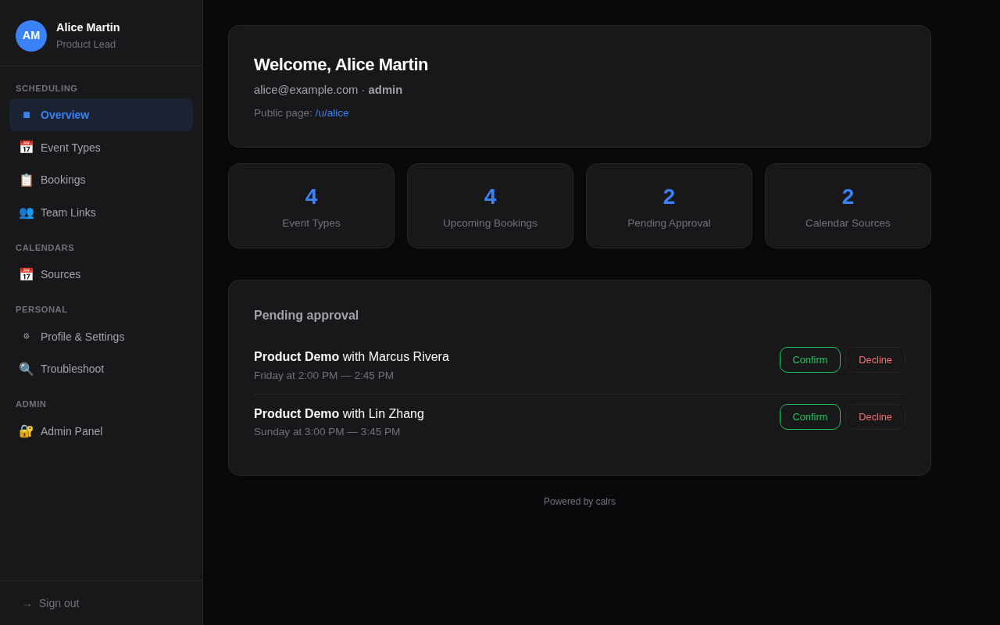<br><b>Dashboard</b></td>
    <td align="center">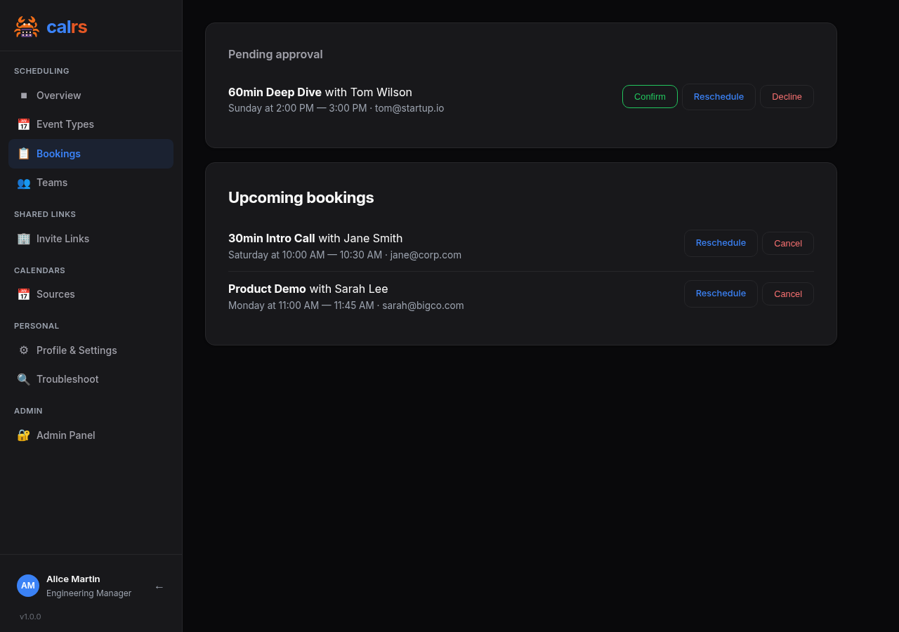<br><b>Bookings</b></td>
  </tr>
  <tr>
    <td align="center"><br><b>Slot picker</b></td>
    <td align="center"><br><b>Booking form</b></td>
  </tr>
  <tr>
    <td align="center">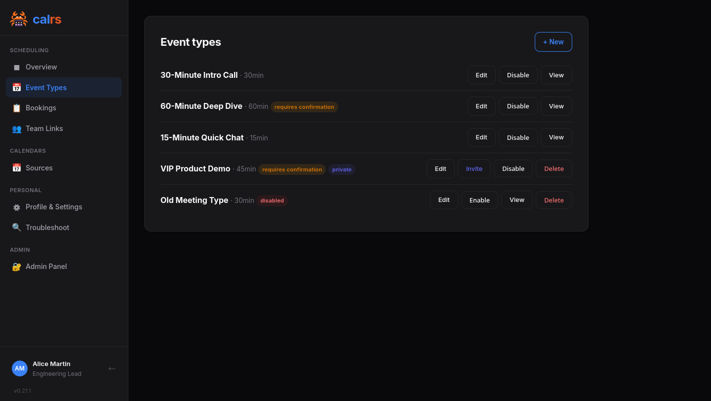<br><b>Event types</b></td>
    <td align="center">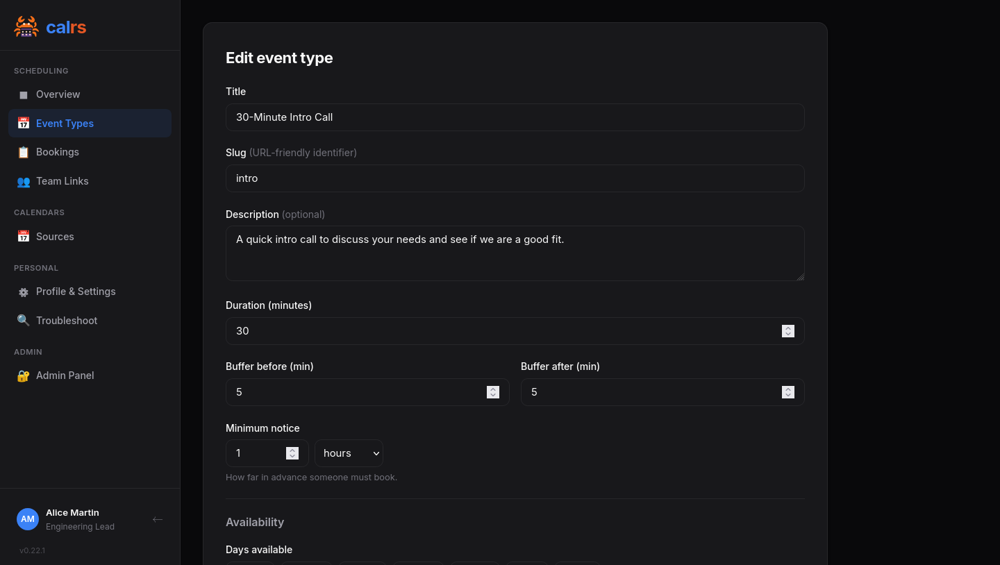<br><b>Event type editor</b></td>
  </tr>
  <tr>
    <td align="center">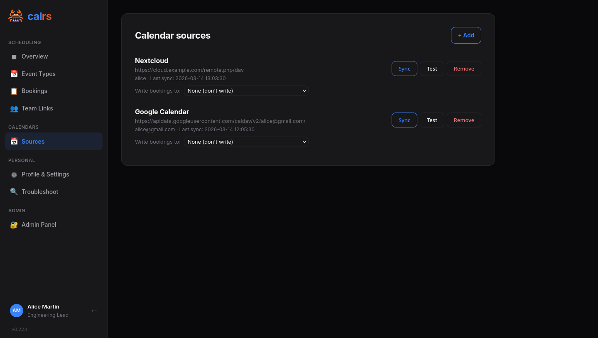<br><b>Calendar sources</b></td>
    <td align="center">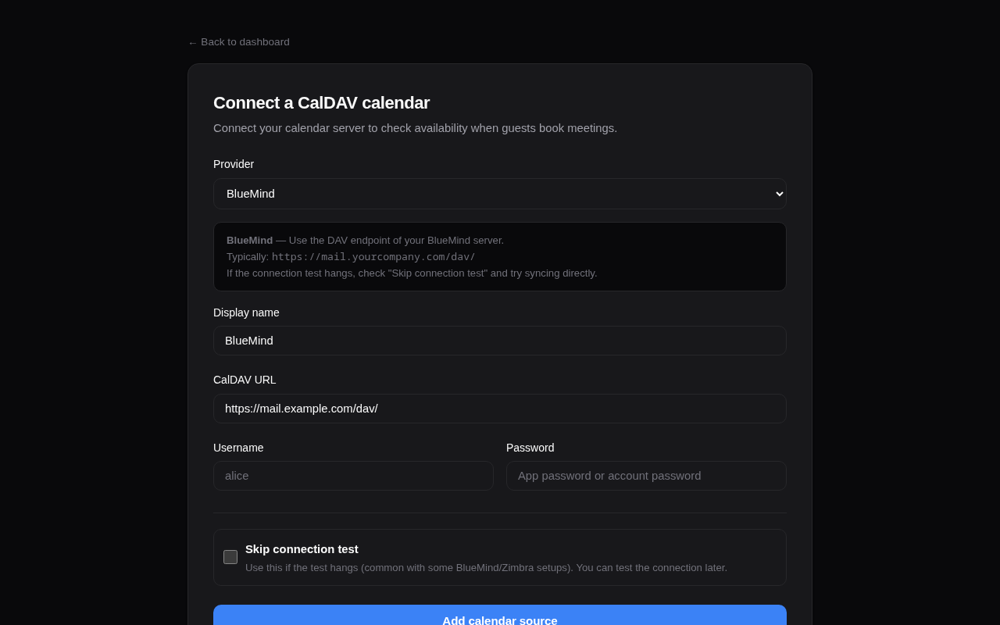<br><b>Add CalDAV source</b></td>
  </tr>
  <tr>
    <td align="center">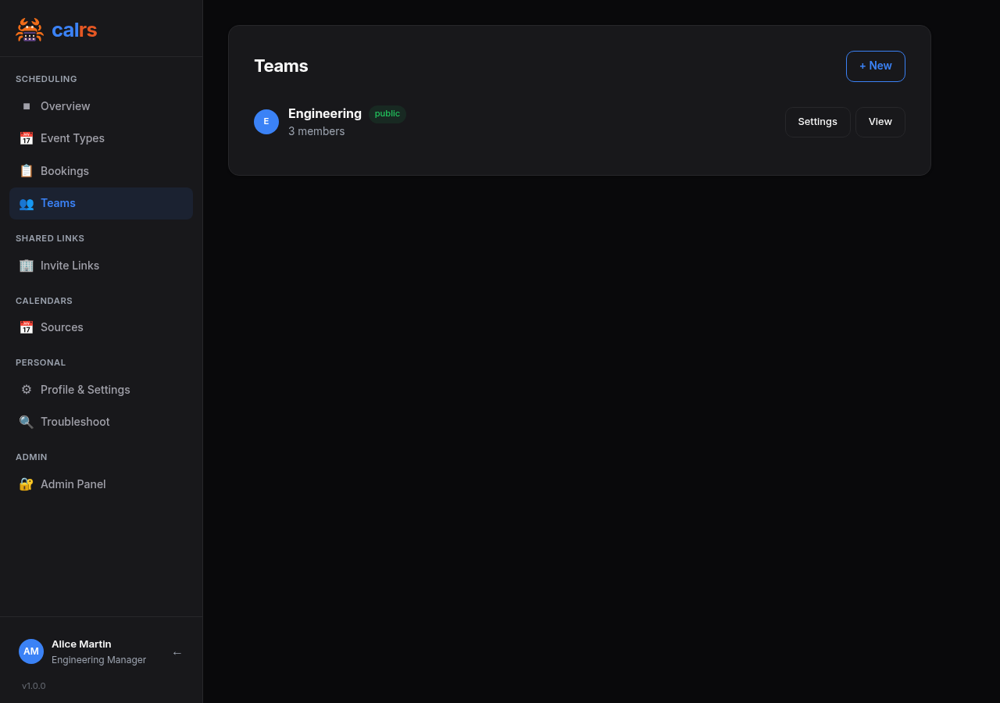<br><b>Teams</b></td>
    <td align="center">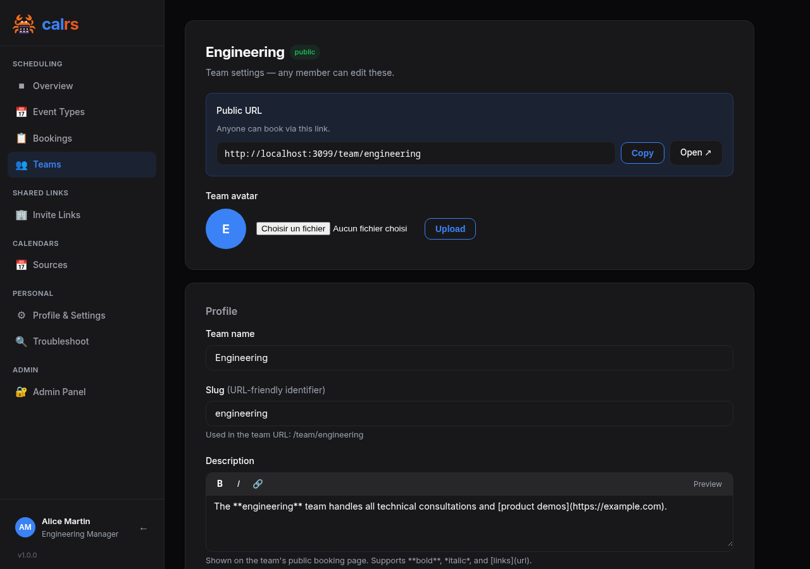<br><b>Team settings</b></td>
  </tr>
  <tr>
    <td align="center"><br><b>Admin panel</b></td>
    <td align="center">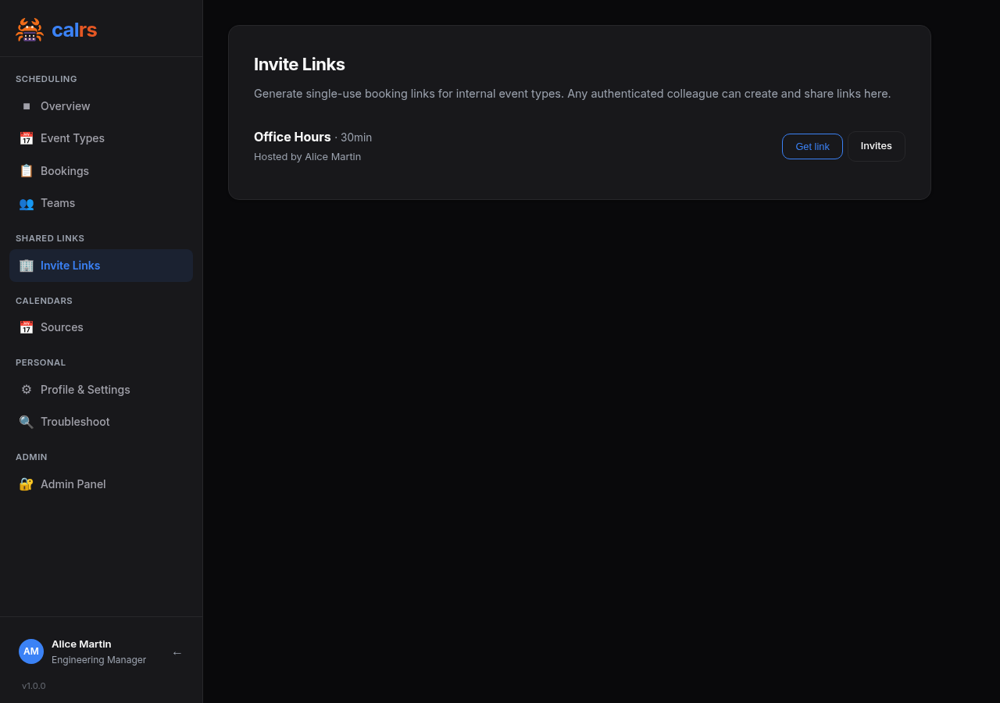<br><b>Invite Links</b></td>
  </tr>
  <tr>
    <td align="center">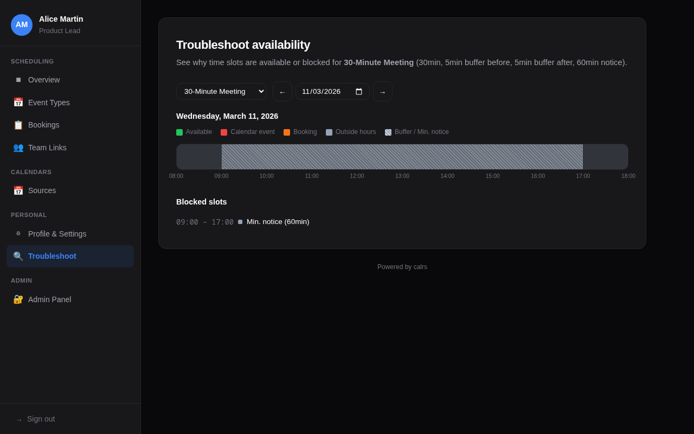<br><b>Availability troubleshoot</b></td>
    <td align="center">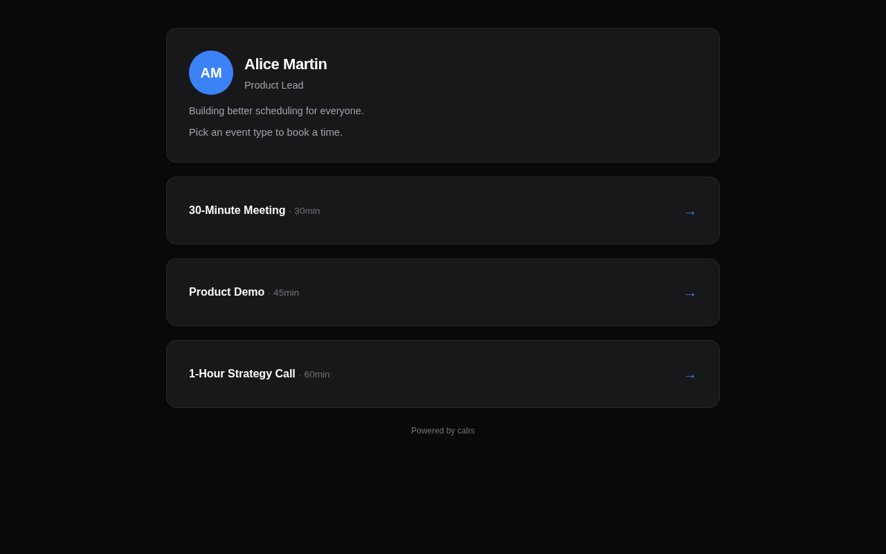<br><b>Public profile</b></td>
  </tr>
  <tr>
    <td align="center">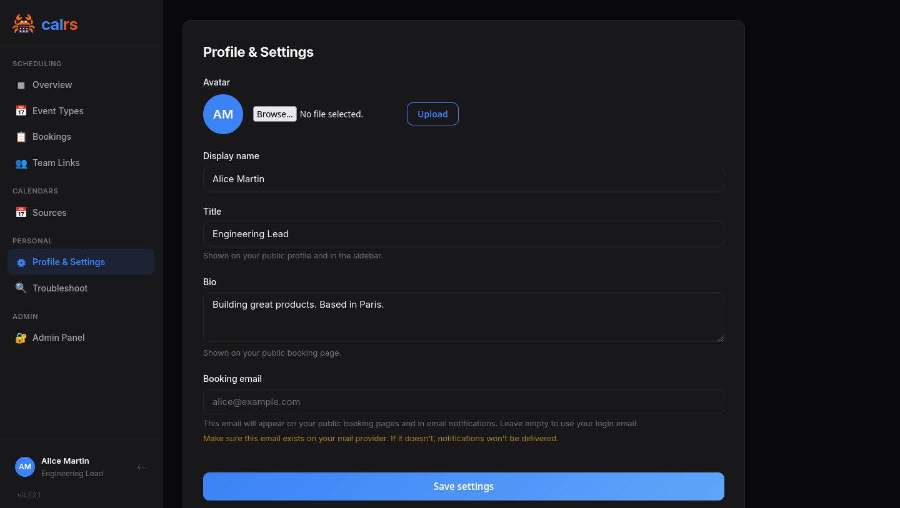<br><b>Profile & Settings</b></td>
    <td align="center"><br><b>Login</b></td>
  </tr>
  <tr>
    <td align="center">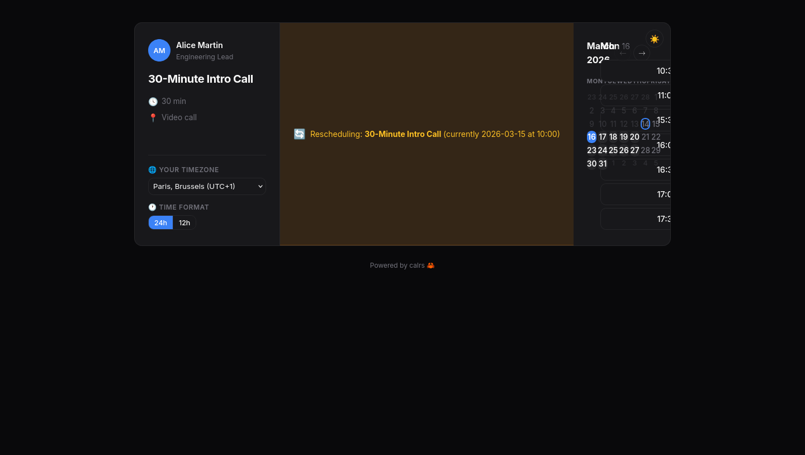<br><b>Reschedule slot picker</b></td>
    <td align="center">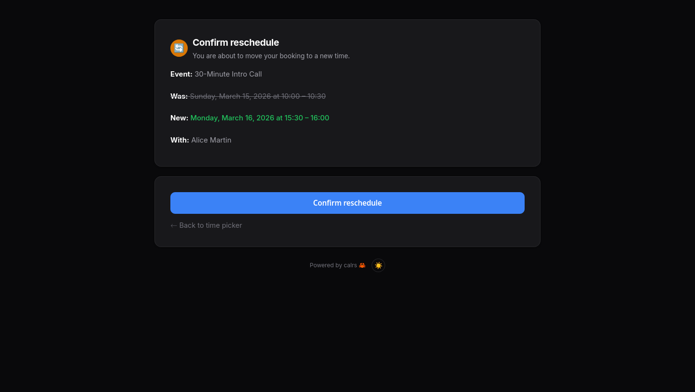<br><b>Reschedule confirmation</b></td>
  </tr>
  <tr>
    <td align="center"><br><b>Dynamic group link</b></td>
    <td align="center"><br><b>Dynamic group link builder</b></td>
  </tr>
  <tr>
    <td align="center" colspan="2">
      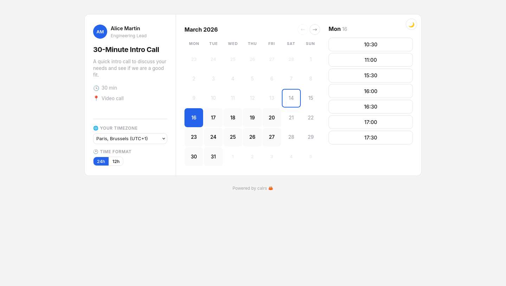<br><b>Light mode</b>
    </td>
  </tr>
  <tr>
    <td align="center">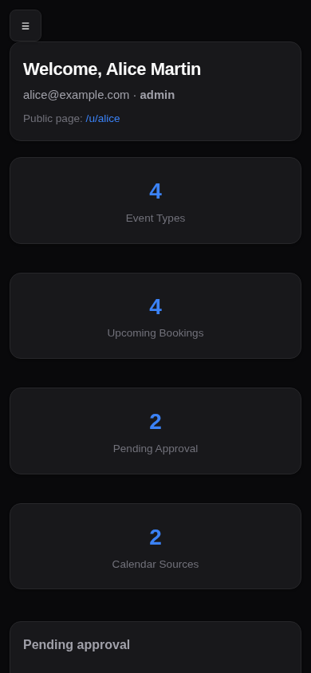<br><b>Mobile dashboard</b></td>
    <td align="center">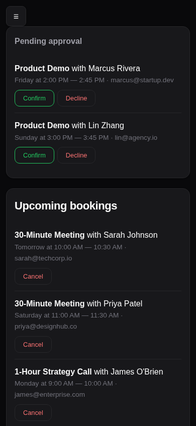<br><b>Mobile bookings</b></td>
  </tr>
</table>

## Features

### Scheduling

- **Event types** — bookable meeting templates with duration, buffer times, minimum notice, and availability schedule
- **Per-event-type calendar selection** — choose which calendars block availability for each event type (e.g. only check work calendar for work meetings); defaults to all calendars if none selected
- **Availability engine** — free/busy computation from availability rules + synced calendar events
- **Recurring event support** — RRULE expansion (DAILY/WEEKLY/MONTHLY with INTERVAL, UNTIL, COUNT, BYDAY, EXDATE)
- **Conflict detection** — validates against both calendar events and existing bookings
- **Pending bookings** — optional confirmation mode: host approves or declines from the dashboard or directly from the email
- **Reschedule** — guests and hosts can reschedule bookings without cancelling. Guests pick a new slot and the host approves; hosts reschedule instantly. Tokens are regenerated, CalDAV events are updated in place, and both parties are notified
- **Timezone support** — guest timezone picker with browser auto-detection, times displayed in the visitor's timezone
- **Timezone-aware CalDAV events** — events are stored with their original calendar timezone and converted to your host timezone for availability checks, so a 10:00 New York event correctly blocks 16:00 in Paris
- **Availability troubleshoot** — visual timeline showing why slots are available or blocked, with event details
- **Calendar view toggle** — guests can switch between month grid, week columns, and column (list) views on the slot picker. Hosts set the default view per event type
- **Booking limits** — cap bookings per day/week/month/year, or show only the earliest slot per day (one slot per day mode)
- **Dynamic group links** — combine usernames in a URL (`/u/alice+bob/intro`) for instant collective meetings without creating a team. All participants' calendars are intersected. Autocomplete user picker in the event type editor, opt-out toggle in settings

### CalDAV integration

- **CalDAV sync** — pull-based sync from any CalDAV server (Nextcloud, BlueMind, Fastmail, iCloud, Zimbra, SOGo, Radicale...), with multi-VEVENT support for recurring event modifications
- **On-demand sync** — booking pages automatically sync the host's calendars if stale (>5 min), using RFC 4791 time-range filtering to fetch only future events
- **CalDAV write-back** — confirmed bookings pushed to the host's calendar, deleted on cancellation
- **Calendar source management** — add, test, sync, and remove sources from the web dashboard or CLI
- **Provider presets** — selecting BlueMind, Nextcloud, etc. auto-fills the CalDAV URL and shows setup tips
- **Auto-discovery** — principal URL and calendar-home-set discovered via PROPFIND (RFC 4791)

### Web interface

- **Web booking page** — public slot picker, booking form, and confirmation page
- **User dashboard** — manage event types, calendar sources, pending approvals, and upcoming bookings
- **Admin dashboard** — user management, auth settings, OIDC config, SMTP status, user impersonation
- **Event type management** — create/edit from the dashboard with availability schedule, location, and confirmation toggle
- **Location support** — video link, phone, in-person, or custom — displayed on booking pages, emails, and `.ics` invites
- **Dark/light theme** — automatic via system preference, with manual toggle (System/Light/Dark) on public pages and dashboard settings
- **Theme engine** — 7 built-in themes (Default, Nord, Dracula, Gruvbox, Solarized, Tokyo Night, Vates) plus custom colors, configurable from the admin dashboard. Every theme adapts to both dark and light modes
- **Cal.com-style slot picker** — 3-panel layout (meeting info sidebar, calendar, time slots) with switchable month/week/column views, dynamic timezone labels with UTC offsets, filled calendar grid with clickable prev/next navigation

### Meeting types

calrs supports seven distinct booking scenarios. Each serves a different use case — there is no overlap:

| Type | Who books? | How do they find it? | Assigned to | Example |
|---|---|---|---|---|
| **Personal (public)** | Anyone | Listed on your profile | You | Freelancer "30min intro call" |
| **Personal (internal)** | Invited guests only | Any colleague generates a link | You | Senior engineer: any teammate can share a "Code Review" link with an external contributor |
| **Personal (private)** | Invited guests only | You send an invite link | You | Executive coaching for selected clients |
| **Team (public)** | Anyone | Listed on team page | Round-robin (least busy) | Public "Support Call" page |
| **Team (internal)** | Invited guests only | Any employee generates a link | Round-robin (least busy) | Cross-team: Sales shares Support booking links with customers |
| **Team (private)** | Invited guests only | Owner sends an invite link | Round-robin (least busy) | Demo team: sales manager sends links to qualified leads |
| **Dynamic group** | Anyone with the URL | Ad-hoc link: `/u/alice+bob/slug` | Event type owner | One-off sales call needing engineering support |

### Teams

- **Unified Teams** — create teams from OIDC groups, hand-picked users, or both. Public or private visibility
- **Scheduling modes** — round-robin (any member free, least-busy assignment) or collective (all members must be free)
- **Team admin role** — team admins manage event types and settings without needing global admin
- **Multi-timezone teams** — set a wide availability window and let each member's synced CalDAV calendar handle the actual blocking
- **Public team pages** — bookable at `/team/{slug}/{event-slug}`
- **Private teams** — require an invite token link, preventing unsolicited external bookings of your colleagues

#### Setting up team scheduling

1. **Create a team** — go to **Teams** in the sidebar, click **New team**. Name it, pick public or private visibility, and add members (individual users and/or OIDC groups) from the unified search bar.

2. **Create a team event type** — go to **Event Types**, click **New event type**, and select your team as the owner. Choose a scheduling mode:
   - **Round-robin** — picks the least-busy available member (with optional per-member weight priority)
   - **Collective** — requires *all* members to be free at the same time

3. **Share the booking link** — public teams are bookable at `/team/{slug}/{event-slug}`. Private teams use an invite token link from the team settings page.

Each team member's CalDAV calendars are checked for conflicts. The availability rules and overrides on the event type apply to all members.

### Visibility & invites

- **Public** — listed on your profile or team page, bookable by anyone with the URL
- **Internal** — not listed publicly. Available for both personal and team event types. Any authenticated colleague can generate a single-use booking link from the **Invite Links** page and share it with an external contact (e.g., paste in Slack or a support ticket). The link expires after 7 days and can't be reused. Unlike private event types where only the owner distributes the link, internal lets **anyone in the organization** be a link distributor — ideal for cross-team services (support, IT help desk) and personal event types that colleagues need to share on your behalf
- **Private** — not listed publicly. Only the event type owner or team admin can send invite links to specific guests
- **Booking invites** — tokenized links with guest name, email, optional message, expiration, and usage limits. Guest info auto-filled on the booking form
- **Quick link generation** — one-click "Get link" on the Invite Links page and invite management page generates a single-use invite URL and copies it to clipboard. No form to fill
- **Availability overrides** — block specific dates (holidays, conferences) or set custom hours per event type. Overrides replace weekly rules for that day

> **Private team vs internal event type:** A private team gates access at the **team level** — the team admin shares one invite link covering all the team's event types. Internal visibility gates access at the **event type level** — any authenticated employee can generate per-event-type links on the fly from the Organization dashboard. Use private teams when you want controlled distribution by a team admin. Use internal when you want self-serve link generation across the org (e.g., any Sales rep can generate a Support Call link for a customer).

### Authentication

- **Local accounts** — email/password with Argon2 hashing, server-side sessions, HttpOnly cookies
- **OIDC / SSO** — OpenID Connect via Keycloak, Authentik, etc. (authorization code + PKCE, auto-discovery)
- **User roles** — admin/user, first registered user becomes admin
- **Registration controls** — enable/disable open registration, restrict by email domain

### Notifications

- **Email notifications** — HTML emails with plain text fallback and `.ics` calendar invites on booking, cancellation, and approval
- **Email approve/decline** — approve or decline pending bookings directly from the notification email (token-based, no login required)
- **Guest self-cancellation** — guests can cancel or reschedule their own bookings via links in the confirmation email
- **Reschedule notifications** — rescheduled booking emails include old and new times, updated `.ics` invites, and reschedule/cancel action buttons
- **Additional attendees** — guests can invite additional people to bookings (configurable per event type: 0/1/3/5/10 max). Additional guests receive ICS invites and appear on the confirmation page
- **Booking reminders** — automated email reminders before meetings, configurable per event type (1h / 4h / 1 day / 2 days)
- **SMTP configuration** — configure from CLI or admin dashboard

### Security

- **Credential encryption** — CalDAV and SMTP passwords encrypted at rest with AES-256-GCM; secret key auto-generated or provided via `CALRS_SECRET_KEY`
- **Hidden password input** — passwords never echoed to the terminal

### Localization

- **Multi-language UI**: public booking flow available in English, French, Spanish, Polish, German, and Italian. Strings are managed via [Fluent](https://projectfluent.org/) and embedded in the binary at compile time, so no runtime files to ship
- **Automatic language detection**: guests get their browser's language (RFC 7231 `Accept-Language` with q-weights). Authenticated users can override the choice in **Profile & Settings**
- **Community-driven translations**: contribute via [Hosted Weblate](https://hosted.weblate.org/projects/calrs/) without needing to touch git or Rust. See [Contributing translations](#contributing-translations)

### Quality

- **Automated test suite** — 500+ tests covering web handlers, CLI commands, auth lifecycle, email rendering, RRULE expansion, iCal parsing, timezone conversion, availability computation, slot generation, database migrations, rate limiting, and more
- **CI pipeline** — every push and pull request runs `cargo fmt`, `cargo clippy`, `cargo test`, and template validation via [GitHub Actions](https://github.com/olivierlambert/calrs/actions/workflows/ci.yml)
- **Docker images** — pre-built multi-arch images (`amd64` + `arm64`) published to [GHCR](https://github.com/olivierlambert/calrs/pkgs/container/calrs) on every release

### Infrastructure

- **SQLite storage** — single-file WAL-mode database, zero ops
- **CLI** — full command set for headless operation (init, source, sync, event-type, booking, config, user)
- **Single binary** — no runtime dependencies beyond the binary itself
- **Structured logging** — `tracing` + `tower-http` for request-level observability, configurable via `RUST_LOG`

## Install

### Docker / Podman (recommended)

Pre-built images are available on [GitHub Container Registry](https://github.com/olivierlambert/calrs/pkgs/container/calrs) for `amd64` and `arm64`:

```bash
docker run -d --name calrs \
  -p 3000:3000 \
  -v calrs-data:/var/lib/calrs \
  -e CALRS_BASE_URL=https://cal.example.com \
  ghcr.io/olivierlambert/calrs:latest
```

> **Podman** works as a drop-in replacement — just use `podman` instead of `docker` in all commands.

Then visit `http://localhost:3000`, register an account, and add your calendars from the dashboard.

### Docker Compose / Podman Compose

```yaml
services:
  calrs:
    image: ghcr.io/olivierlambert/calrs:latest
    ports:
      - "3000:3000"
    volumes:
      - calrs-data:/var/lib/calrs
    environment:
      - CALRS_BASE_URL=https://cal.example.com
    restart: unless-stopped

volumes:
  calrs-data:
```

Works with both `docker compose` and `podman-compose`.

> To build from source instead, replace `image: ghcr.io/olivierlambert/calrs:latest` with `build: .` (or use `docker build -t calrs .`).

### Binary + systemd

```bash
# Build from source
cargo build --release

# Install
sudo cp target/release/calrs /usr/local/bin/
sudo cp -r templates /var/lib/calrs/templates

# Create a system user
sudo useradd -r -s /bin/false -m -d /var/lib/calrs calrs

# Install and configure the service
sudo cp calrs.service /etc/systemd/system/
sudo systemctl daemon-reload
sudo systemctl enable --now calrs
```

Edit `/etc/systemd/system/calrs.service` to set `CALRS_BASE_URL` to your public URL. The service runs on port 3000 by default — put a reverse proxy in front for TLS (see [Reverse proxy](#reverse-proxy) below).

### From source (development)

```bash
cargo build --release
calrs serve --port 3000
```

Then register at `http://localhost:3000` — the first user becomes admin.

### Build the documentation

```bash
# Install mdBook (one time)
cargo install mdbook

# Build and serve the docs
cd docs
mdbook serve --open
```

This builds the user documentation from `docs/src/` and opens it in your browser. The docs are also available as static HTML in `docs/book/`.

## CLI quick start

Once installed, you can manage everything from the web UI or use the CLI:

```bash
# Connect your CalDAV calendar
calrs source add --url https://nextcloud.example.com/remote.php/dav \
                 --username alice --name "My Calendar"

# Pull events
calrs sync

# Create a bookable meeting type
calrs event-type create --title "30min intro call" --slug intro --duration 30

# Check your availability
calrs event-type slots intro

# Book a slot
calrs booking create intro --date 2026-03-20 --time 14:00 \
  --name "Jane Doe" --email jane@example.com
```

## Connecting your calendar

calrs connects to any CalDAV server. You need the **DAV root URL** for your provider — not a calendar-specific or public link. When adding a source from the web dashboard, selecting a provider auto-fills the URL pattern.

### Common CalDAV URLs

- **BlueMind** — `https://mail.yourcompany.com/dav/`
- **Nextcloud** — `https://cloud.example.com/remote.php/dav`
- **Fastmail** — `https://caldav.fastmail.com/dav/calendars/user/you@fastmail.com/` (use an app-specific password)
- **iCloud** — `https://caldav.icloud.com/` (use an app-specific password from appleid.apple.com)
- **Zimbra** — `https://mail.example.com/dav/`
- **SOGo** — `https://mail.example.com/SOGo/dav/`
- **Radicale** — `https://cal.example.com/`

calrs auto-discovers your principal URL and calendar-home-set via PROPFIND (RFC 4791). If the connection test hangs or fails, use the "skip connection test" option and try syncing directly.

**Google Calendar is not currently supported.** Google dropped Basic Auth for CalDAV in 2020 and now requires OAuth2, and Google "app passwords" only work for IMAP/SMTP. To use Google Calendar availability in calrs, bridge it through a CalDAV server that can subscribe to a Google calendar (for example, Nextcloud's calendar app).

## OIDC setup (Keycloak example)

1. In your Keycloak realm, create a new **OpenID Connect** client:
   - **Client ID**: `calrs`
   - **Client authentication**: ON (confidential)
   - **Valid redirect URIs**: `https://your-calrs-host/auth/oidc/callback`
   - **Web origins**: `https://your-calrs-host`

2. Copy the **Client secret** from the Credentials tab.

3. Configure calrs:

```bash
calrs config oidc \
  --issuer-url https://keycloak.example.com/realms/your-realm \
  --client-id calrs \
  --client-secret YOUR_CLIENT_SECRET \
  --enabled true \
  --auto-register true
```

4. Set the base URL and start:

```bash
export CALRS_BASE_URL=https://your-calrs-host
calrs serve --port 3000
```

The login page will show a "Sign in with SSO" button. With `--auto-register true`, users are created automatically on first OIDC login. Existing local users are linked by email.

## Reverse proxy

calrs listens on HTTP (port 3000 by default). Use a reverse proxy for TLS termination.

### Caddy

The simplest option — automatic HTTPS with Let's Encrypt:

```
cal.example.com {
    reverse_proxy localhost:3000
}
```

Save as `/etc/caddy/Caddyfile` and reload: `sudo systemctl reload caddy`.

### Nginx

```nginx
server {
    listen 443 ssl http2;
    server_name cal.example.com;

    ssl_certificate     /etc/letsencrypt/live/cal.example.com/fullchain.pem;
    ssl_certificate_key /etc/letsencrypt/live/cal.example.com/privkey.pem;

    location / {
        proxy_pass http://127.0.0.1:3000;
        proxy_set_header Host $host;
        proxy_set_header X-Real-IP $remote_addr;
        proxy_set_header X-Forwarded-For $proxy_add_x_forwarded_for;
        proxy_set_header X-Forwarded-Proto $scheme;
    }
}

server {
    listen 80;
    server_name cal.example.com;
    return 301 https://$host$request_uri;
}
```

Get certificates with certbot: `sudo certbot --nginx -d cal.example.com`.

> **Important:** Set `CALRS_BASE_URL` to your public URL (e.g. `https://cal.example.com`) so that OIDC redirect URIs and email links point to the right host.

## Observability

calrs uses structured logging via the `tracing` crate. All log output goes to stderr and is captured by systemd journal, Docker logs, or any log aggregator.

### Configuration

Set the log level via the `RUST_LOG` environment variable:

```bash
# Default (recommended for production)
RUST_LOG=calrs=info,tower_http=info

# Verbose (debug HTTP requests + internal events)
RUST_LOG=calrs=debug,tower_http=debug

# Quiet (errors only)
RUST_LOG=calrs=error
```

### Log categories

| Category | Level | Events |
|----------|-------|--------|
| **Auth** | info/warn | Login success/failure, registration, logout, OIDC login |
| **Bookings** | info | Created, cancelled, approved, declined, guest self-cancel, reminder sent |
| **CalDAV** | info/error | Sync started/completed, write-back success/failure, source added/removed |
| **Admin** | info/warn | Role changes, user enable/disable, auth/OIDC config updates, impersonation |
| **Email** | debug/error | Delivery success, send failures |
| **HTTP** | info | Every request via `tower-http` TraceLayer (method, path, status, latency) |
| **Database** | info | Migration applied on startup |
| **Server** | info | Startup, shutdown |

### Example output

```
2026-03-12T14:30:00Z  INFO calrs: calrs server listening on 127.0.0.1:3000
2026-03-12T14:30:05Z  INFO calrs::auth: user login email=alice@example.com ip=192.168.1.1
2026-03-12T14:31:00Z  INFO calrs::web: booking created booking_id=a1b2c3 event_type=intro guest=bob@example.com
2026-03-12T14:31:01Z  INFO tower_http::trace: response{method=POST path="/u/alice/intro/book" status=200 latency="45ms"}
2026-03-12T14:31:02Z ERROR calrs::web: CalDAV write-back failed uid=a1b2c3@calrs error="connection refused"
2026-03-12T14:32:00Z  WARN calrs::auth: login failed email=eve@example.com ip=10.0.0.5
2026-03-12T15:00:00Z  WARN calrs::web: rate limited ip=10.0.0.5
```

## CLI reference

```
calrs source add [--no-test]         Connect a CalDAV calendar
calrs source list                    List connected sources
calrs source remove <id>             Remove a source
calrs source test <id>               Test a connection
calrs sync [--full]                  Pull latest events from CalDAV
calrs event-type create              Define a new bookable meeting
calrs event-type list                List your event types
calrs event-type slots <slug>        Show available slots
calrs calendar show [--from] [--to]  View your calendar
calrs booking create <slug>          Book a slot
calrs booking list [--upcoming]      View bookings
calrs booking cancel <id>            Cancel a booking
calrs config smtp                    Configure SMTP for email notifications
calrs config show                    Show current configuration
calrs config smtp-test <email>       Send a test email
calrs config auth                    Configure registration/domain restrictions
calrs config oidc                    Configure OIDC (SSO via Keycloak, etc.)
calrs user list                      List users
calrs user create                    Create a user
calrs user set-password <email>      Set a user's password
calrs user promote <email>           Promote user to admin
calrs serve [--host 127.0.0.1] [--port 3000]  Start the web booking server
```

## Architecture

```
calrs/
├── Cargo.toml
├── migrations/              SQLite schema (incremental)
├── templates/               Minijinja HTML templates
│   ├── base.html            Base layout + CSS (dark mode)
│   ├── auth/                Login + registration
│   ├── dashboard_base.html  Sidebar layout for all dashboard pages
│   ├── dashboard_overview.html  Overview with stats
│   ├── dashboard_event_types.html  Event types listing
│   ├── dashboard_bookings.html  Bookings listing
│   ├── dashboard_sources.html  Calendar sources
│   ├── dashboard_teams.html Teams listing
│   ├── dashboard_internal.html  Internal/organization event types
│   ├── admin.html           Admin panel
│   ├── settings.html        Profile & settings
│   ├── event_type_form.html Create/edit event types
│   ├── invite_form.html     Invite management (send + list)
│   ├── overrides.html       Date overrides per event type
│   ├── source_form.html     Add CalDAV source (provider presets)
│   ├── source_test.html     Connection test / sync results
│   ├── source_write_setup.html  Write-back calendar selection
│   ├── team_form.html       Create/manage teams
│   ├── team_settings.html   Team settings (members, groups)
│   ├── team_profile.html    Public team page
│   ├── profile.html         Public user profile
│   ├── troubleshoot.html    Availability troubleshoot timeline
│   ├── slots.html           Slot picker (timezone aware)
│   ├── book.html            Booking form
│   ├── confirmed.html       Confirmation / pending page
│   ├── booking_approved.html   Email approve success
│   ├── booking_decline_form.html  Email decline form
│   ├── booking_declined.html   Email decline success
│   ├── booking_cancel_form.html  Guest self-cancel form
│   ├── booking_cancelled_guest.html  Guest cancel success
│   ├── booking_host_reschedule.html  Host reschedule page
│   ├── booking_reschedule_confirm.html  Reschedule confirmation
│   └── booking_action_error.html  Invalid/expired token error
└── src/
    ├── main.rs              CLI entry point (clap)
    ├── db.rs                SQLite connection + migrations
    ├── models.rs            Domain types
    ├── auth.rs              Authentication (local + OIDC)
    ├── email.rs             SMTP email with .ics invites + HTML templates
    ├── rrule.rs             Recurring event expansion (RRULE)
    ├── utils.rs             Shared utilities (iCal splitting/parsing)
    ├── caldav/mod.rs        CalDAV client (RFC 4791) + write-back
    ├── web/mod.rs           Axum web server + all handlers
    └── commands/            CLI subcommands
```

**Storage:** SQLite (WAL mode). Single file, zero ops.

**CalDAV:** Pull-based sync for free/busy, write-back for confirmed bookings.

## Roadmap

- [x] CalDAV sync (pull) with auto-discovery
- [x] Availability engine with conflict detection
- [x] Recurring event expansion (RRULE)
- [x] Email notifications with `.ics` invites
- [x] Web booking page with dark mode
- [x] Authentication (local + OIDC/SSO)
- [x] User and group management
- [x] Team event types (combined availability + round-robin)
- [x] Timezone support (guest picker + CalDAV event timezone conversion)
- [x] Calendar source management from the web UI
- [x] Docker image + systemd service
- [x] CalDAV write-back (push confirmed bookings to your calendar)
- [x] Availability troubleshoot page
- [x] HTML emails with action buttons
- [x] Email approve/decline for pending bookings
- [x] Admin impersonation
- [x] Per-event-type calendar selection
- [x] Unified Teams (public/private, round-robin/collective, team admin role)
- [x] Private event types with invite links
- [x] Cal.com-style slot picker (month calendar, 3-panel layout)
- [x] Dark/light theme toggle
- [x] Theme engine (7 presets + custom colors)
- [x] Additional attendees on bookings
- [x] Reschedule flow (change date/time without cancelling)
- [x] Availability overrides (block specific dates, set custom hours)
- [x] Three-level visibility (public / internal / private) with quick invite link generation
- [x] Calendar view toggle (month / week / column)
- [x] Booking frequency limits + one slot per day
- [ ] Webhooks (per-event-type HTTP callbacks on new/cancelled bookings)
- [x] Delta sync using CalDAV `sync-token` / `ctag`
- [x] Multi-language support (i18n) — see [Localization](#localization)
- [ ] REST API for third-party integrations

## Localization

[](https://hosted.weblate.org/engage/calrs/)

calrs ships with translations for English, French, Spanish, Polish, German, and Italian. Strings are stored in [Fluent](https://projectfluent.org/) `.ftl` files under `i18n/` and embedded in the binary at compile time.

### How language is selected

| Visitor | Source of truth |
|---|---|
| Guest (not logged in) | Browser `Accept-Language` header, with q-weights honoured |
| Logged-in user with no preference set | Same as above |
| Logged-in user with a preference set | The user's choice in **Profile & Settings** |

Untranslated keys fall back to English at runtime, so a partial translation never breaks the page.

### Contributing translations

Translators do not need to touch git, Rust, or even know the project structure. Everything happens in the browser:

1. Open the project on Hosted Weblate: <https://hosted.weblate.org/projects/calrs/>
2. Pick your language (or click **Start new translation** if it isn't listed)
3. Translate strings in the web editor

Saved translations flow back to the `i18n` branch automatically. Maintainers periodically merge that branch into `main`, and the next release ships with your work.

If you want a language that isn't yet listed, open an issue or just start translating it on Weblate. Adding a new locale on the calrs side is a one-line change.

### For developers

- Translation source lives in `i18n/{lang}/main.ftl` (one file per language, kebab-case message IDs)
- Loader: `src/i18n.rs`. Strings are accessed in templates via `{{ t("message-id", arg=value) }}`
- New translatable strings should land on the `i18n` branch first so translators see them on Weblate before the next merge into `main`

## License

AGPL-3.0 — free to use, modify, and self-host. Contributions welcome.
