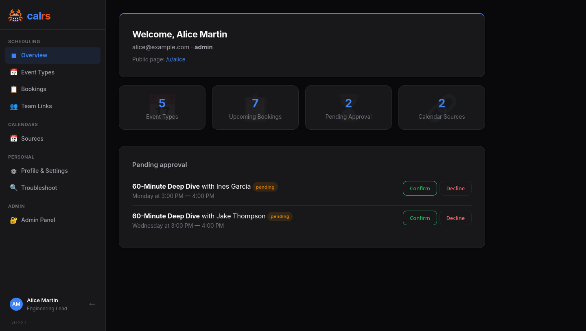

<p align="center">
  
</p>

# calrs

[](https://github.com/olivierlambert/calrs/actions/workflows/ci.yml)

**Fast, self-hostable scheduling. Like Cal.com, but written in Rust.**

<p align="center">
  <a href="https://cal.rs">Website</a> &middot;
  <a href="https://cal.rs/docs/">Documentation</a> &middot;
  <a href="https://github.com/olivierlambert/calrs/releases">Releases</a>
</p>

> _"Your time, your stack."_

`calrs` is an open-source scheduling platform built in Rust. Connect your CalDAV calendar (Nextcloud, Fastmail, BlueMind, iCloud, Google...), define bookable meeting types, and share a link. No Node.js, no PostgreSQL, no subscription.

<p align="center">
  
</p>

## Features

### Scheduling

- **Event types** — bookable meeting templates with duration, buffer times, minimum notice, and availability schedule
- **Per-event-type calendar selection** — choose which calendars block availability for each event type (e.g. only check work calendar for work meetings); defaults to all calendars if none selected
- **Availability engine** — free/busy computation from availability rules + synced calendar events
- **Recurring event support** — RRULE expansion (DAILY/WEEKLY/MONTHLY with INTERVAL, UNTIL, COUNT, BYDAY, EXDATE)
- **Conflict detection** — validates against both calendar events and existing bookings
- **Pending bookings** — optional confirmation mode: host approves or declines from the dashboard or directly from the email
- **Timezone support** — guest timezone picker with browser auto-detection, times displayed in the visitor's timezone
- **Timezone-aware CalDAV events** — events are stored with their original calendar timezone and converted to your host timezone for availability checks, so a 10:00 New York event correctly blocks 16:00 in Paris
- **Availability troubleshoot** — visual timeline showing why slots are available or blocked, with event details

### CalDAV integration

- **CalDAV sync** — pull-based sync from any CalDAV server (Nextcloud, BlueMind, Fastmail, iCloud, Google, Zimbra, SOGo, Radicale...), with multi-VEVENT support for recurring event modifications
- **On-demand sync** — booking pages automatically sync the host's calendars if stale (>5 min), using RFC 4791 time-range filtering to fetch only future events
- **CalDAV write-back** — confirmed bookings pushed to the host's calendar, deleted on cancellation
- **Calendar source management** — add, test, sync, and remove sources from the web dashboard or CLI
- **Provider presets** — selecting BlueMind, Nextcloud, etc. auto-fills the CalDAV URL and shows setup tips
- **Auto-discovery** — principal URL and calendar-home-set discovered via PROPFIND (RFC 4791)

### Web interface

- **Web booking page** — public slot picker, booking form, and confirmation page
- **User dashboard** — manage event types, calendar sources, pending approvals, and upcoming bookings
- **Admin dashboard** — user management, auth settings, OIDC config, SMTP status, user impersonation
- **Event type management** — create/edit from the dashboard with availability schedule, location, and confirmation toggle
- **Location support** — video link, phone, in-person, or custom — displayed on booking pages, emails, and `.ics` invites
- **Dark mode** — automatic via `prefers-color-scheme`, clean responsive design

### Groups

- **OIDC group sync** — groups synced from Keycloak `groups` JWT claim on SSO login
- **Group event types** — combined availability (any member free) with round-robin assignment
- **Public group pages** — bookable at `/g/{group-slug}/{slug}`

### Authentication

- **Local accounts** — email/password with Argon2 hashing, server-side sessions, HttpOnly cookies
- **OIDC / SSO** — OpenID Connect via Keycloak, Authentik, etc. (authorization code + PKCE, auto-discovery)
- **User roles** — admin/user, first registered user becomes admin
- **Registration controls** — enable/disable open registration, restrict by email domain

### Notifications

- **Email notifications** — HTML emails with plain text fallback and `.ics` calendar invites on booking, cancellation, and approval
- **Email approve/decline** — approve or decline pending bookings directly from the notification email (token-based, no login required)
- **Guest self-cancellation** — guests can cancel their own bookings via a link in the confirmation email, with optional reason
- **Booking reminders** — automated email reminders before meetings, configurable per event type (1h / 4h / 1 day / 2 days)
- **SMTP configuration** — configure from CLI or admin dashboard

### Security

- **Credential encryption** — CalDAV and SMTP passwords encrypted at rest with AES-256-GCM; secret key auto-generated or provided via `CALRS_SECRET_KEY`
- **Hidden password input** — passwords never echoed to the terminal

### Infrastructure

- **SQLite storage** — single-file WAL-mode database, zero ops
- **CLI** — full command set for headless operation (init, source, sync, event-type, booking, config, user)
- **Single binary** — no runtime dependencies beyond the binary itself

## Install

### Docker / Podman (recommended)

```bash
docker build -t calrs .
docker run -d --name calrs \
  -p 3000:3000 \
  -v calrs-data:/var/lib/calrs \
  -e CALRS_BASE_URL=https://cal.example.com \
  calrs
```

> **Podman** works as a drop-in replacement — just use `podman` instead of `docker` in all commands.

Then visit `http://localhost:3000`, register an account, and add your calendars from the dashboard.

### Docker Compose / Podman Compose

```yaml
services:
  calrs:
    build: .
    ports:
      - "3000:3000"
    volumes:
      - calrs-data:/var/lib/calrs
    environment:
      - CALRS_BASE_URL=https://cal.example.com
    restart: unless-stopped

volumes:
  calrs-data:
```

Works with both `docker compose` and `podman-compose`.

### Binary + systemd

```bash
# Build from source
cargo build --release

# Install
sudo cp target/release/calrs /usr/local/bin/
sudo cp -r templates /var/lib/calrs/templates

# Create a system user
sudo useradd -r -s /bin/false -m -d /var/lib/calrs calrs

# Install and configure the service
sudo cp calrs.service /etc/systemd/system/
sudo systemctl daemon-reload
sudo systemctl enable --now calrs
```

Edit `/etc/systemd/system/calrs.service` to set `CALRS_BASE_URL` to your public URL. The service runs on port 3000 by default — put a reverse proxy in front for TLS (see [Reverse proxy](#reverse-proxy) below).

### From source (development)

```bash
cargo build --release
calrs serve --port 3000
```

Then register at `http://localhost:3000` — the first user becomes admin.

### Build the documentation

```bash
# Install mdBook (one time)
cargo install mdbook

# Build and serve the docs
cd docs
mdbook serve --open
```

This builds the user documentation from `docs/src/` and opens it in your browser. The docs are also available as static HTML in `docs/book/`.

## CLI quick start

Once installed, you can manage everything from the web UI or use the CLI:

```bash
# Connect your CalDAV calendar
calrs source add --url https://nextcloud.example.com/remote.php/dav \
                 --username alice --name "My Calendar"

# Pull events
calrs sync

# Create a bookable meeting type
calrs event-type create --title "30min intro call" --slug intro --duration 30

# Check your availability
calrs event-type slots intro

# Book a slot
calrs booking create intro --date 2026-03-20 --time 14:00 \
  --name "Jane Doe" --email jane@example.com
```

## Connecting your calendar

calrs connects to any CalDAV server. You need the **DAV root URL** for your provider — not a calendar-specific or public link. When adding a source from the web dashboard, selecting a provider auto-fills the URL pattern.

### Common CalDAV URLs

- **BlueMind** — `https://mail.yourcompany.com/dav/`
- **Nextcloud** — `https://cloud.example.com/remote.php/dav`
- **Fastmail** — `https://caldav.fastmail.com/dav/calendars/user/you@fastmail.com/` (use an app-specific password)
- **iCloud** — `https://caldav.icloud.com/` (use an app-specific password from appleid.apple.com)
- **Google** — `https://apidata.googleusercontent.com/caldav/v2/your@gmail.com/`
- **Zimbra** — `https://mail.example.com/dav/`
- **SOGo** — `https://mail.example.com/SOGo/dav/`
- **Radicale** — `https://cal.example.com/`

calrs auto-discovers your principal URL and calendar-home-set via PROPFIND (RFC 4791). If the connection test hangs or fails, use the "skip connection test" option and try syncing directly.

## OIDC setup (Keycloak example)

1. In your Keycloak realm, create a new **OpenID Connect** client:
   - **Client ID**: `calrs`
   - **Client authentication**: ON (confidential)
   - **Valid redirect URIs**: `https://your-calrs-host/auth/oidc/callback`
   - **Web origins**: `https://your-calrs-host`

2. Copy the **Client secret** from the Credentials tab.

3. Configure calrs:

```bash
calrs config oidc \
  --issuer-url https://keycloak.example.com/realms/your-realm \
  --client-id calrs \
  --client-secret YOUR_CLIENT_SECRET \
  --enabled true \
  --auto-register true
```

4. Set the base URL and start:

```bash
export CALRS_BASE_URL=https://your-calrs-host
calrs serve --port 3000
```

The login page will show a "Sign in with SSO" button. With `--auto-register true`, users are created automatically on first OIDC login. Existing local users are linked by email.

## Reverse proxy

calrs listens on HTTP (port 3000 by default). Use a reverse proxy for TLS termination.

### Caddy

The simplest option — automatic HTTPS with Let's Encrypt:

```
cal.example.com {
    reverse_proxy localhost:3000
}
```

Save as `/etc/caddy/Caddyfile` and reload: `sudo systemctl reload caddy`.

### Nginx

```nginx
server {
    listen 443 ssl http2;
    server_name cal.example.com;

    ssl_certificate     /etc/letsencrypt/live/cal.example.com/fullchain.pem;
    ssl_certificate_key /etc/letsencrypt/live/cal.example.com/privkey.pem;

    location / {
        proxy_pass http://127.0.0.1:3000;
        proxy_set_header Host $host;
        proxy_set_header X-Real-IP $remote_addr;
        proxy_set_header X-Forwarded-For $proxy_add_x_forwarded_for;
        proxy_set_header X-Forwarded-Proto $scheme;
    }
}

server {
    listen 80;
    server_name cal.example.com;
    return 301 https://$host$request_uri;
}
```

Get certificates with certbot: `sudo certbot --nginx -d cal.example.com`.

> **Important:** Set `CALRS_BASE_URL` to your public URL (e.g. `https://cal.example.com`) so that OIDC redirect URIs and email links point to the right host.

## CLI reference

```
calrs source add [--no-test]         Connect a CalDAV calendar
calrs source list                    List connected sources
calrs source remove <id>             Remove a source
calrs source test <id>               Test a connection
calrs sync [--full]                  Pull latest events from CalDAV
calrs event-type create              Define a new bookable meeting
calrs event-type list                List your event types
calrs event-type slots <slug>        Show available slots
calrs calendar show [--from] [--to]  View your calendar
calrs booking create <slug>          Book a slot
calrs booking list [--upcoming]      View bookings
calrs booking cancel <id>            Cancel a booking
calrs config smtp                    Configure SMTP for email notifications
calrs config show                    Show current configuration
calrs config smtp-test <email>       Send a test email
calrs config auth                    Configure registration/domain restrictions
calrs config oidc                    Configure OIDC (SSO via Keycloak, etc.)
calrs user list                      List users
calrs user create                    Create a user
calrs user set-password <email>      Set a user's password
calrs user promote <email>           Promote user to admin
calrs serve [--host 127.0.0.1] [--port 3000]  Start the web booking server
```

## Architecture

```
calrs/
├── Cargo.toml
├── migrations/              SQLite schema (incremental)
├── templates/               Minijinja HTML templates
│   ├── base.html            Base layout + CSS (dark mode)
│   ├── auth/                Login + registration
│   ├── dashboard.html       User dashboard
│   ├── admin.html           Admin panel
│   ├── source_form.html     Add CalDAV source (provider presets)
│   ├── event_type_form.html Create/edit event types
│   ├── slots.html           Slot picker (timezone aware)
│   ├── book.html            Booking form
│   ├── confirmed.html       Confirmation / pending page
│   ├── troubleshoot.html    Availability troubleshoot timeline
│   ├── booking_approved.html   Email approve success
│   ├── booking_decline_form.html  Email decline form
│   ├── booking_declined.html   Email decline success
│   └── booking_action_error.html  Invalid/expired token error
└── src/
    ├── main.rs              CLI entry point (clap)
    ├── db.rs                SQLite connection + migrations
    ├── models.rs            Domain types
    ├── auth.rs              Authentication (local + OIDC)
    ├── email.rs             SMTP email with .ics invites + HTML templates
    ├── rrule.rs             Recurring event expansion (RRULE)
    ├── utils.rs             Shared utilities (iCal splitting/parsing)
    ├── caldav/mod.rs        CalDAV client (RFC 4791) + write-back
    ├── web/mod.rs           Axum web server + all handlers
    └── commands/            CLI subcommands
```

**Storage:** SQLite (WAL mode). Single file, zero ops.

**CalDAV:** Pull-based sync for free/busy, write-back for confirmed bookings.

## Roadmap

- [x] CalDAV sync (pull) with auto-discovery
- [x] Availability engine with conflict detection
- [x] Recurring event expansion (RRULE)
- [x] Email notifications with `.ics` invites
- [x] Web booking page with dark mode
- [x] Authentication (local + OIDC/SSO)
- [x] User and group management
- [x] Group event types (combined availability + round-robin)
- [x] Timezone support (guest picker + CalDAV event timezone conversion)
- [x] Calendar source management from the web UI
- [x] Docker image + systemd service
- [x] CalDAV write-back (push confirmed bookings to your calendar)
- [x] Availability troubleshoot page
- [x] HTML emails with action buttons
- [x] Email approve/decline for pending bookings
- [x] Admin impersonation
- [x] Per-event-type calendar selection
- [ ] Webhooks (per-event-type HTTP callbacks on new/cancelled bookings)
- [ ] Reschedule flow (change date/time without cancelling)
- [ ] Availability overrides (block specific dates, add special hours)
- [ ] Delta sync using CalDAV `sync-token` / `ctag`
- [ ] Multi-language support (i18n)
- [ ] REST API for third-party integrations

## License

AGPL-3.0 — free to use, modify, and self-host. Contributions welcome.
