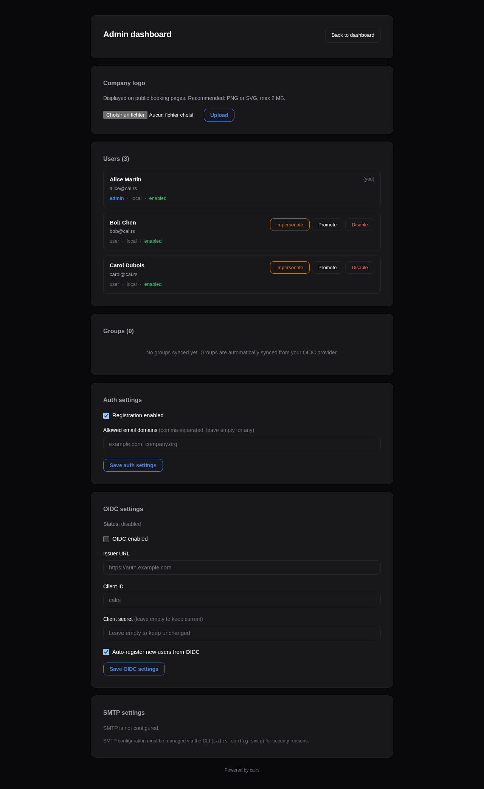

# Admin Dashboard

The admin dashboard is available at `/dashboard/admin` for users with the `admin` role.

## User management

Lists all registered users with:

- Name, email, username
- Role (admin/user)
- Status (enabled/disabled)
- Groups (if using OIDC group sync)

Actions per user:

- **Promote/Demote** — toggle admin role
- **Enable/Disable** — disabled users cannot log in or receive bookings
- **Impersonate** — view the dashboard as that user (for troubleshooting)

## Impersonation

Admins can impersonate any user to troubleshoot their view:

1. Click **Impersonate** next to a user in the admin panel
2. You are redirected to the dashboard, viewing it as that user
3. A yellow banner at the top shows who you're impersonating
4. Click **Stop impersonating** to return to your own view

Impersonation uses a separate `calrs_impersonate` cookie (24-hour TTL). The real admin session is preserved.

## Availability troubleshoot

For each event type, the dashboard offers a **Troubleshoot** link that opens a visual timeline at `/dashboard/troubleshoot/{event_type_id}`:

- Shows candidate slots for the next 7 days
- Displays why each slot is blocked (calendar event name, existing booking, buffer overlap)
- Helps debug availability issues when users report incorrect free/busy status

## Authentication settings

- **Registration** — toggle open registration on/off
- **Allowed domains** — restrict registration to specific email domains (comma-separated) or allow any

## OIDC configuration

- **Enabled** — toggle SSO login on/off
- **Issuer URL** — your OIDC provider's base URL
- **Client ID** — the client ID registered with your provider
- **Client secret** — update the secret (current value is never displayed)
- **Auto-register** — automatically create users on first OIDC login

## SMTP status

Shows whether SMTP is configured and the current sender address. SMTP is configured via CLI (`calrs config smtp`) or by editing the database directly.
