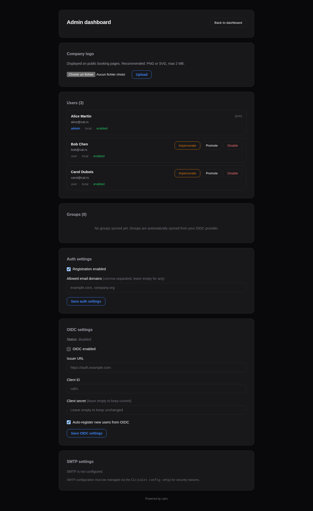
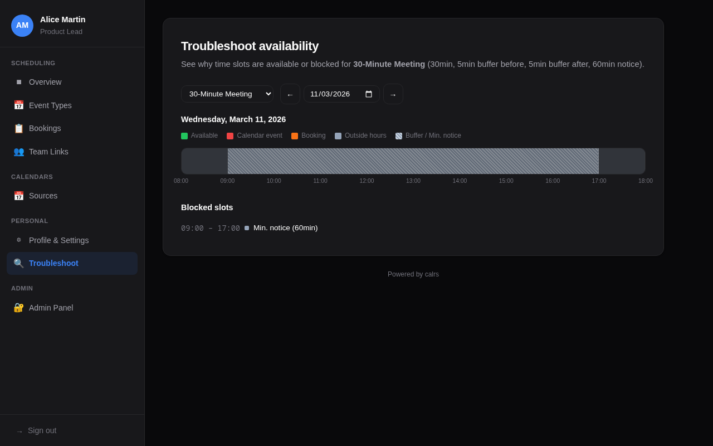

# Admin Dashboard

The admin dashboard is available at `/dashboard/admin` for users with the `admin` role.

## User management

Lists all registered users with:

- Name, email, username
- Role (admin/user)
- Status (enabled/disabled)
- Teams and groups

Actions per user:

- **Promote/Demote** — toggle admin role
- **Enable/Disable** — disabled users cannot log in or receive bookings
- **Impersonate** — view the dashboard as that user (for troubleshooting)

## Impersonation

Admins can impersonate any user to troubleshoot their view:

1. Click **Impersonate** next to a user in the admin panel
2. You are redirected to the dashboard, viewing it as that user
3. A yellow banner at the top shows who you're impersonating
4. Click **Stop impersonating** to return to your own view

Impersonation uses a separate `calrs_impersonate` cookie (24-hour TTL). The real admin session is preserved.

## Availability troubleshoot

For each event type, the dashboard offers a **Troubleshoot** link that opens a visual timeline at `/dashboard/troubleshoot/{event_type_id}`:

- Shows candidate slots for the next 7 days
- Displays why each slot is blocked (calendar event name, existing booking, buffer overlap)
- Helps debug availability issues when users report incorrect free/busy status

## Authentication settings

- **Registration** — toggle open registration on/off
- **Allowed domains** — restrict registration to specific email domains (comma-separated) or allow any

## OIDC configuration

- **Enabled** — toggle SSO login on/off
- **Issuer URL** — your OIDC provider's base URL
- **Client ID** — the client ID registered with your provider
- **Client secret** — update the secret (current value is never displayed)
- **Auto-register** — automatically create users on first OIDC login

## Google OAuth2

Admin → Auth → Google OAuth2 holds the instance-wide Google client ID and secret used when users connect Google Calendar. The same credentials are used to attach a Google Meet conference to a confirmed booking when an event type uses the Google Meet location. There is no extra Meet admin form. See [Google Calendar](./google-calendar.md).

## Resources

The **Resources** card manages [shared bookable resources](./resources.md) (demo lab, meeting rooms): add a resource from its ICS feed URL, edit its optional CalDAV write-back settings and team allowlist, force a sync with **Sync now**, and verify write access with **Test write**. A failed feed sync is flagged here with the last error. See [Shared Resources](./resources.md) for details.

## SMS settings

The **SMS settings** card configures the instance's [SMS gateway](./sms.md): pick Twilio, GatewayAPI, seven.io, or a generic webhook, and the form relabels its fields for that vendor. The same card holds the daily message limit, today's usage and cost, and the policy controlling whether non-admins may enable SMS on their own event types.

**Test gateway** sends a real message to a number you give it, or verifies the credentials for free when you leave the field empty and the gateway supports it.

SMS spends real money on a public form, so the card also warns when SMS is configured without a captcha. See [SMS Notifications](./sms.md) for the setup steps and for keeping the bill bounded.

## SMTP status

Shows whether SMTP is configured and the current sender address. SMTP is configured via CLI (`calrs config smtp`) or by editing the database directly.
