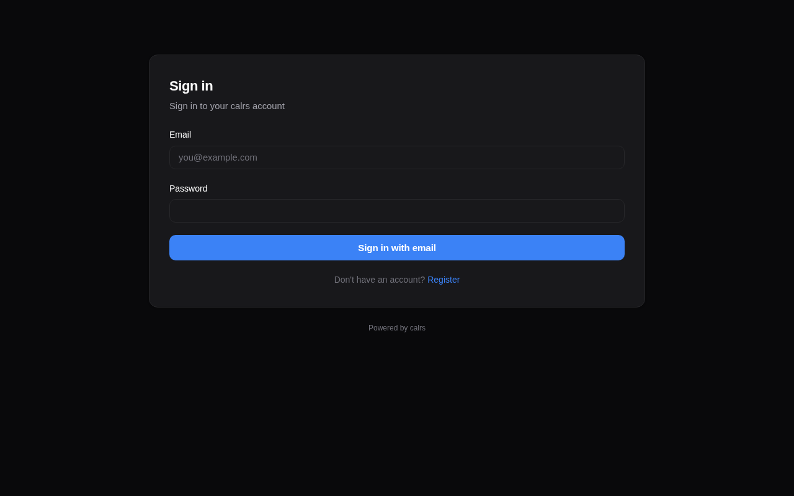

# Authentication

calrs supports two authentication methods: local accounts and OIDC (OpenID Connect) SSO.



## Local accounts

### Registration

- The first user to register becomes **admin**
- Registration can be enabled/disabled from the admin dashboard or CLI
- Registration can be restricted to specific email domains

```bash
# Disable open registration
calrs config auth --registration false

# Restrict to a domain
calrs config auth --allowed-domains company.com

# Allow any domain
calrs config auth --allowed-domains any
```

### Password hashing

Passwords are hashed with **Argon2** (via the `argon2` crate with `password-hash`). Plain-text passwords are never stored.

### Sessions

- Server-side sessions stored in SQLite
- 30-day TTL
- Session ID in an **HttpOnly** cookie (not accessible to JavaScript)
- Sessions are invalidated on logout

### User management (CLI)

```bash
calrs user create --email alice@example.com --name "Alice" --admin
calrs user list
calrs user set-password alice@example.com
calrs user promote alice@example.com    # → admin
calrs user demote alice@example.com     # → user
calrs user disable alice@example.com
calrs user enable alice@example.com
```

## OIDC / SSO

calrs supports OpenID Connect for single sign-on, tested with Keycloak and compatible with any OIDC provider (Authentik, Auth0, etc.).

### Features

- **Authorization code flow with PKCE** — no client secret stored in the browser
- **Auto-discovery** — reads `.well-known/openid-configuration` from the issuer URL
- **User linking by email** — if a local user exists with the same email, the OIDC identity is linked
- **Auto-registration** — new users are created on first OIDC login (if enabled)
- **Group sync** — groups from the `groups` JWT claim are synced on each login and can be linked to teams

### Configuration

```bash
calrs config oidc \
  --issuer-url https://keycloak.example.com/realms/your-realm \
  --client-id calrs \
  --client-secret YOUR_CLIENT_SECRET \
  --enabled true \
  --auto-register true
```

Or from the **Admin dashboard > OIDC** section.

### Keycloak setup

1. Create a new **OpenID Connect** client:
   - **Client ID:** `calrs`
   - **Client authentication:** ON (confidential)
   - **Valid redirect URIs:** `https://your-calrs-host/auth/oidc/callback`
   - **Web origins:** `https://your-calrs-host`
2. Copy the **Client secret** from the Credentials tab
3. Set `CALRS_BASE_URL` to your public URL before starting the server

The login page will show a **"Sign in with SSO"** button when OIDC is enabled.

## User roles

| Role | Capabilities |
|---|---|
| `user` | Manage own event types, calendar sources, bookings |
| `team admin` | Everything above + manage team event types and team members |
| `admin` | Everything above + user management, auth settings, OIDC config, SMTP config |

The first registered user is automatically promoted to admin.

## Email notifications (SMTP)

SMTP configuration is required for booking confirmation emails. Without it, bookings still work but no emails are sent.

```bash
calrs config smtp \
  --host smtp.example.com \
  --port 587 \
  --username calrs@example.com \
  --from-email calrs@example.com \
  --from-name "calrs"

# Test the configuration
calrs config smtp-test you@example.com

# View current config
calrs config show
```

Or configure from the **Admin dashboard > SMTP** section.
