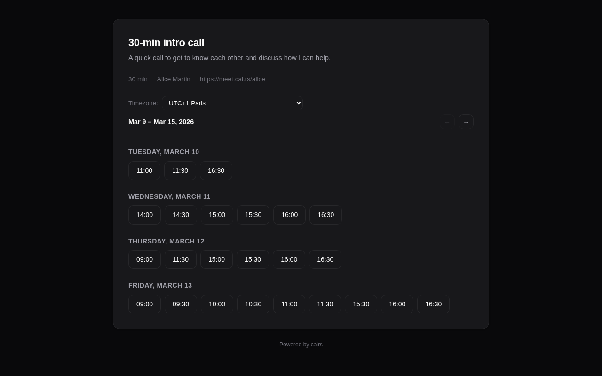
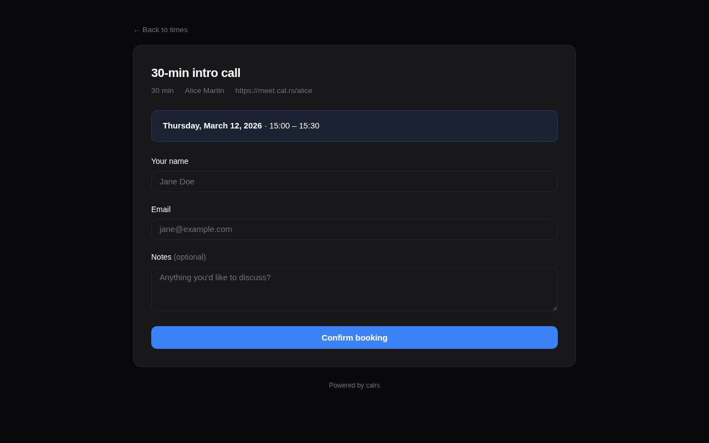

# Booking Flow

## Guest experience

1. **Visit the booking page** — `/u/host/meeting-slug`
2. **Pick a timezone** — auto-detected from the browser, changeable via dropdown
3. **Browse available slots** — displayed as a week view, navigate with Previous/Next buttons
4. **Click a slot** — opens the booking form
5. **Fill in details** — name, email, optional notes
6. **Submit** — booking is created
7. **Confirmation page** — shows booking summary
8. **Email** — guest receives a confirmation email with an `.ics` calendar invite attached





## Booking statuses

| Status | Description |
|---|---|
| `confirmed` | Booking is active. Slot is blocked. Emails sent. |
| `pending` | Awaiting host approval (when `requires_confirmation` is on). |
| `cancelled` | Cancelled by host or guest. Slot is freed. |
| `declined` | Declined by host (pending booking rejected). |

## Confirmation mode

When an event type has **requires confirmation** enabled:

1. Guest submits booking → status is `pending`
2. Guest receives a "pending" email (no `.ics` yet)
3. Host receives an "approval request" email with **Approve** and **Decline** buttons
4. Host can approve/decline in two ways:
   - **From the email** — click the Approve or Decline button (no login required, token-based)
   - **From the dashboard** — go to **Pending approval** section and click Confirm or Decline
5. On confirm: status becomes `confirmed`, guest receives confirmation email with `.ics`, booking is pushed to CalDAV
6. On decline: status becomes `declined`, guest receives a decline notification with optional reason

> **Note:** The email action buttons require `CALRS_BASE_URL` to be set. Without it, the host must use the dashboard.

## Cancellation

From the dashboard, click **Cancel** on an upcoming booking:

1. Optionally enter a reason
2. Confirm the cancellation
3. Both guest and host receive cancellation emails with a `METHOD:CANCEL` `.ics` attachment
4. If the booking was pushed to CalDAV, the event is deleted from the calendar

### Guest self-cancellation

Guests can cancel their own bookings via a link in the confirmation email:

1. Click the "Cancel booking" link in the email
2. Optionally enter a reason
3. Confirm the cancellation
4. Both guest and host are notified

The cancellation email correctly attributes who cancelled (host vs guest).

## Conflict detection

Before a booking is accepted, calrs checks for conflicts:

- **Calendar events** — from synced CalDAV sources
- **Existing bookings** — confirmed bookings on any event type
- **Buffer times** — the buffer before/after is included in the conflict window
- **Minimum notice** — slots too close to the current time are rejected

Additionally, a database-level unique index prevents two bookings from occupying the same slot, even if two guests submit simultaneously.

## CalDAV write-back

When a booking is confirmed (either directly or via approval), calrs can push the event to the host's CalDAV calendar. See [CalDAV Integration > Write-back](./caldav.md#caldav-write-back) for setup.

## Email notifications

If SMTP is configured, calrs sends emails at these moments:

| Event | Guest receives | Host receives |
|---|---|---|
| Booking confirmed | Confirmation + `.ics` REQUEST | Notification + `.ics` REQUEST |
| Booking pending | "Awaiting confirmation" notice | Approval request with Approve/Decline buttons |
| Booking declined | Decline notice (with optional reason) | — |
| Booking cancelled | Cancellation + `.ics` CANCEL | Cancellation + `.ics` CANCEL |
| Booking reminder | Reminder with cancel button | Reminder with details |

All emails are sent as **HTML with plain text fallback**. They include event title, date, time, timezone, location, and notes. The HTML templates are responsive and support dark mode in email clients that honor `prefers-color-scheme`.

## Timezone handling

- Guest's timezone is auto-detected via `Intl.DateTimeFormat` in the browser
- A timezone dropdown lets the guest change it
- Slots are displayed in the guest's selected timezone
- The booking is stored in the host's timezone
- The timezone is preserved across navigation (week picker, booking form)

## CLI booking

```bash
calrs booking create intro \
  --date 2026-03-20 --time 14:00 \
  --name "Jane Doe" --email jane@example.com \
  --timezone Europe/Paris --notes "Let's discuss the project"
```
