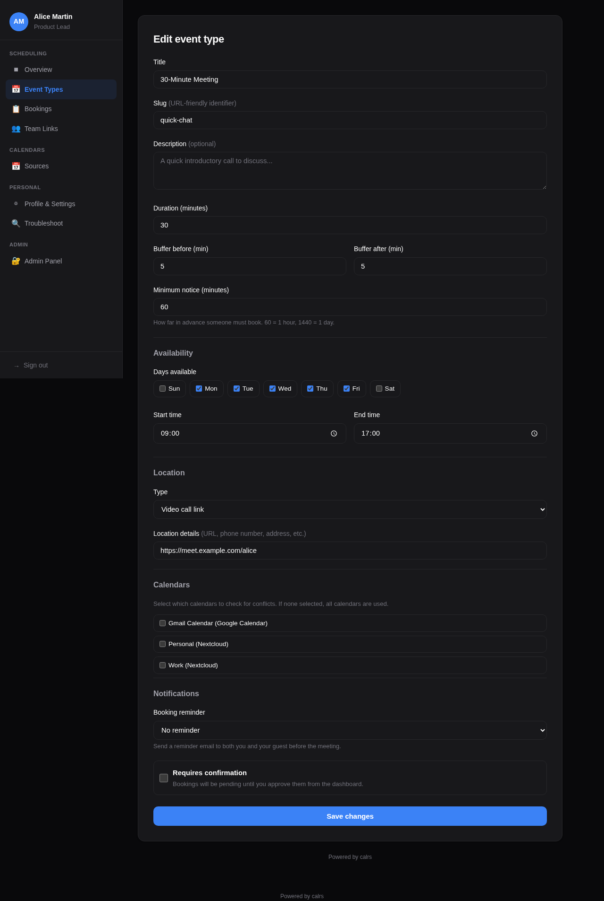

# Event Types

Event types are bookable meeting templates. Each one defines the duration, availability schedule, and booking rules.

## Meeting types overview

calrs supports six distinct booking scenarios:

| Type | Who books? | How? | Assigned to | Use case |
|---|---|---|---|---|
| **Personal (public)** | Anyone | Listed on your profile | You | Freelancer's "30min intro call" |
| **Personal (internal)** | Invited guests | Any colleague generates a link | You | Senior engineer: teammates share a "Code Review" link with external contributors |
| **Personal (private)** | Invited guests | You send an invite link | You | Executive coaching for selected clients |
| **Team (public)** | Anyone | Listed on team page | Round-robin | Public support call page |
| **Team (internal)** | Invited guests | Any employee generates a link | Round-robin | Cross-team: Sales shares Support links with customers |
| **Team (private)** | Invited guests | Owner sends invite links | Round-robin | Demo team sends links to qualified leads |

**Personal vs team:** Personal event types book time on your calendar only. Team event types show combined availability (any member free) and assign the booking to the least-busy member via round-robin.

**Multi-timezone teams:** For teams spread across timezones, set a wide availability window (e.g., 06:00–23:00) and let each member's synced CalDAV calendar handle the blocking. The slot picker naturally shows the union of all members' real availability — see [Teams > Multi-timezone teams](./teams.md#multi-timezone-teams) for details.

## Creating an event type

### From the dashboard

Go to **Dashboard > Event types > + New** and fill in:

- **Title** — display name (e.g., "30-minute intro call")
- **Slug** — URL path (e.g., `intro` gives `/u/yourname/intro`)
- **Duration** — meeting length in minutes
- **Buffer before/after** — padding between meetings (prevents back-to-back bookings)
- **Minimum notice** — how far in advance guests must book (in minutes)
- **Requires confirmation** — if checked, bookings start as "pending" and you approve from the dashboard
- **Additional guests** — allow guests to invite additional attendees (0, 1, 3, 5, or 10 max)
- **Location** — video link, phone number, in-person address, or custom text
- **Availability schedule** — which days and hours you're available

Description fields support Markdown formatting (bold, italic, links) with a toolbar and live preview.



### From the CLI

```bash
calrs event-type create \
  --title "30min intro call" \
  --slug intro \
  --duration 30 \
  --buffer-before 5 \
  --buffer-after 5
```

## Calendar selection

When you have multiple CalDAV calendars, you can choose **which calendars block availability** for each event type. For example, a "Work meeting" event type can check only the work calendar, while a "Personal chat" checks only the personal calendar.

From the dashboard form, select the calendars under the **Calendars** section. Only calendars marked as "busy" (`is_busy=1`) appear.

**Default behavior:** If no calendars are selected, all busy calendars are checked — same as before. This is fully backward-compatible.

## Availability schedule

Each event type has its own availability rules. By default: Monday–Friday, 09:00–17:00.

From the dashboard form, you can set:

- Which days of the week are available (checkboxes)
- Start and end time for available hours

The availability engine intersects these rules with your synced calendar events (filtered by selected calendars) and existing bookings to compute free slots.

## Slot computation

Available slots are computed by:

1. Generating candidate slots from availability rules (day of week + time range)
2. Filtering out slots that overlap with calendar events (from CalDAV sync)
3. Filtering out slots that overlap with confirmed bookings
4. Applying buffer times (before and after each slot)
5. Removing slots that violate minimum notice (too close to now)

```bash
# View available slots for the next 7 days
calrs event-type slots intro

# View slots for the next 14 days
calrs event-type slots intro --days 14
```

## Location

Event types support four location types:

| Type | Description |
|---|---|
| `link` | Video meeting URL (Zoom, Meet, etc.) |
| `phone` | Phone number |
| `in_person` | Physical address |
| `custom` | Free-text description |

The location is displayed on the public booking page, in confirmation emails, and in `.ics` calendar invites.

## Enabling/disabling

Event types can be toggled on/off from the dashboard without deleting them. Disabled event types don't show up on your public profile and return 404 on their booking page.

## Visibility

Event types have three visibility levels, set from the **Visibility** dropdown in the event type form:

| Level | Available for | Listed publicly? | Who can create invite links? | Badge |
|---|---|---|---|---|
| **Public** | Personal + Team | Yes | N/A (no invite needed) | *(none)* |
| **Internal** | Personal + Team | No | Any authenticated user | blue "internal" |
| **Private** | Personal + Team | No | Event type owner only | indigo "private" |

### Internal event types

Internal visibility is designed for **cross-team and cross-person booking within an organization**. It is available for both personal and team event types.

**Typical use case (team):** A Support team creates an internal "Support Call" event type. When a Sales rep needs to put a customer in touch with Support, they go to the **Invite Links** page, click **"Get link"** next to "Support Call", and paste the generated URL in a Slack message or email to the customer. The customer clicks the link, picks a slot, and books — the link expires after 7 days and can't be reused.

**Typical use case (personal):** A senior engineer creates an internal "Code Review" event type. Any teammate can generate a one-time link from the Invite Links page and share it with an external contributor who needs a review session.

The **Invite Links** page (`/dashboard/organization`) lists all internal event types across the organization — both personal and team. Each event type has:

- **Get link** — generates a single-use invite link (expires in 7 days) and copies it to clipboard
- **Invites** — opens the full invite management page for custom expiry, multi-use links, and guest pre-fill

> **Internal vs private:** Internal lets **any colleague** generate links on the fly — ideal for cross-org services like support, IT help desk, or personal event types that colleagues need to share on your behalf. Private restricts link distribution to the **event type owner only** — better when you want controlled access. See [Teams > Private teams vs internal vs private event types](./teams.md#private-teams-vs-internal-vs-private-event-types) for a detailed comparison.

### Private event types

Private event types are hidden from public pages and only accessible via invite links sent by the event type owner or team admin.

**Typical use case:** A demo team creates a private team event type. Sales reps send personalized invites to qualified leads. The demo is automatically assigned to the least-busy team member via round-robin.

### Invite links

Both internal and private event types use **booking invites** to grant access:

1. Go to **Dashboard > Event Types** (or **Organization**) and click **Invite**
2. Fill in the guest's name, email, and an optional personal message
3. Choose an expiration (7, 14, or 30 days, or never) and whether to allow multiple bookings
4. Click **Send invite** — the guest receives an email with a personalized booking link

The invite link takes the guest directly to the slot picker with the invite token embedded. Their name and email are pre-filled on the booking form. The token is validated at every step (expired, used-up, or invalid tokens are rejected).

### Invite management

The invite management page (`/dashboard/invites/{event_type_id}`) shows:

- A **"Get link"** button at the top for one-click link generation — generates a single-use invite URL and copies it to your clipboard. No email form needed
- A form to send invites via email (with guest name, email, message, expiry, and usage options)
- A list of sent invites with status badges:
  - **Active** — invite is valid and unused (or has remaining uses)
  - **Expired** — past the expiration date
  - **Used** — all uses consumed (for single-use invites)
- Delete button to revoke an invite

## Availability overrides

Block specific dates or set custom hours per event type — perfect for holidays, conferences, or one-off schedule changes.

Go to **Dashboard > Event Types > Overrides** and add:

- **Block entire day** — no slots available on that date (e.g., company holiday)
- **Custom hours** — replace the weekly rules with specific time windows for that date (e.g., 08:00–12:00 only)

Multiple custom hour windows can be added for the same date (e.g., morning + afternoon with a lunch break). Overrides are visible in the **Troubleshoot** view with a banner showing when they're active.

## Public URLs


- **Profile:** `/u/yourname` — lists all enabled, non-private event types
- **Slot picker:** `/u/yourname/slug` — shows available time slots
- **Booking form:** `/u/yourname/slug/book?date=...&time=...` — booking form for a specific slot
- **Invite booking:** same URLs with `?invite={token}` — for private event types accessed via invite links
