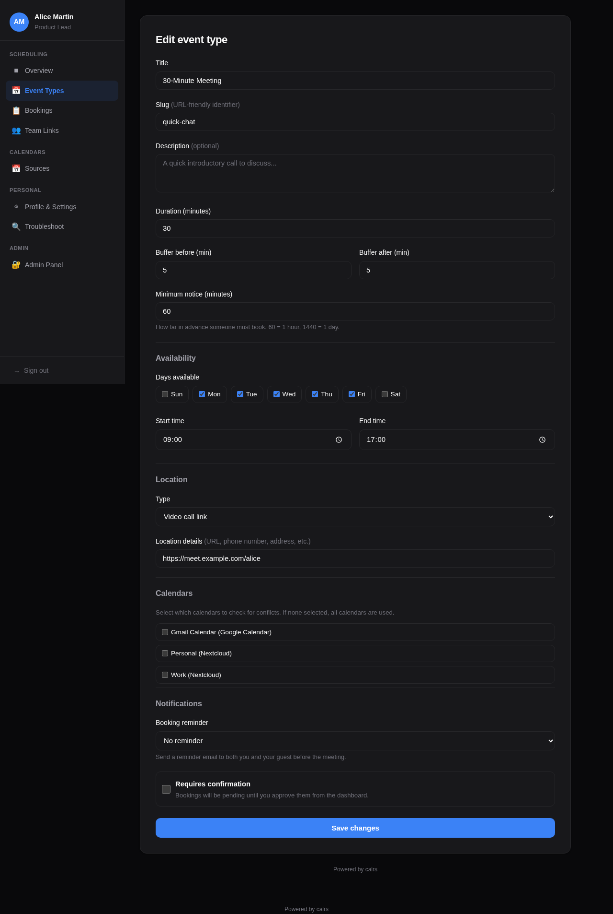
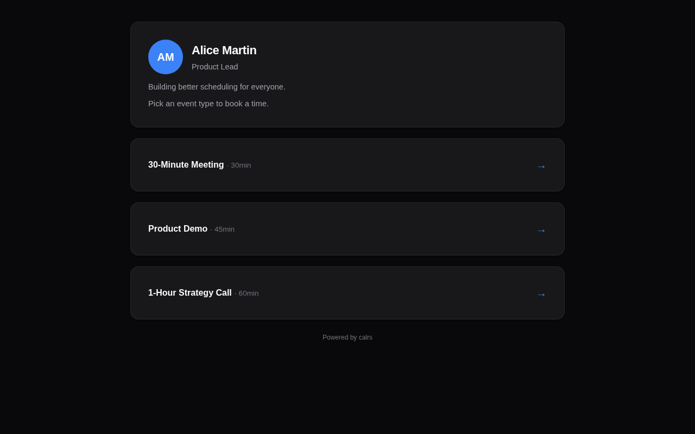

# Event Types

Event types are bookable meeting templates. Each one defines the duration, availability schedule, and booking rules.

## Meeting types overview

calrs supports seven distinct booking scenarios:

| Type | Who books? | How? | Assigned to | Use case |
|---|---|---|---|---|
| **Personal (public)** | Anyone | Listed on your profile | You | Freelancer's "30min intro call" |
| **Personal (internal)** | Invited guests | Any colleague generates a link | You | Senior engineer: teammates share a "Code Review" link with external contributors |
| **Personal (private)** | Invited guests | You send an invite link | You | Executive coaching for selected clients |
| **Team (public)** | Anyone | Listed on team page | Round-robin | Public support call page |
| **Team (internal)** | Invited guests | Any employee generates a link | Round-robin | Cross-team: Sales shares Support links with customers |
| **Team (private)** | Invited guests | Owner sends invite links | Round-robin | Demo team sends links to qualified leads |
| **Dynamic group** | Anyone with the URL | Ad-hoc link: `/u/alice+bob/slug` | Event type owner | One-off sales call needing engineering support |

**Personal vs team:** Personal event types book time on your calendar only. Team event types show combined availability (any member free) and assign the booking to the least-busy member via round-robin.

**Dynamic group links:** Ad-hoc collective meetings without creating a team — see [Dynamic group links](#dynamic-group-links) below.

**Multi-timezone teams:** For teams spread across timezones, set a wide availability window (e.g., 06:00–23:00) and let each member's synced CalDAV calendar handle the blocking. The slot picker naturally shows the union of all members' real availability — see [Teams > Multi-timezone teams](./teams.md#multi-timezone-teams) for details.

## Creating an event type

### From the dashboard

Go to **Dashboard > Event types > + New** and fill in:

- **Title** — display name (e.g., "30-minute intro call")
- **Slug** — URL path (e.g., `intro` gives `/u/yourname/intro`)
- **Duration** — meeting length in minutes
- **Slot interval** — how often slots start (optional; leave blank to match duration — see [Slot interval](#slot-interval) below)
- **Buffer before/after** — padding between meetings (prevents back-to-back bookings)
- **Minimum notice** — how far in advance guests must book (in minutes)
- **Requires confirmation** — if checked, bookings start as "pending" and you approve from the dashboard
- **Additional guests** — allow guests to invite additional attendees (0, 1, 3, 5, or 10 max)
- **Location** — video link, phone number, in-person address, or custom text
- **Availability schedule** — which days and hours you're available

Description fields support Markdown formatting (bold, italic, links) with a toolbar and live preview.



### From the CLI

```bash
calrs event-type create \
  --title "30min intro call" \
  --slug intro \
  --duration 30 \
  --buffer-before 5 \
  --buffer-after 5
```

## Calendar selection

When you have multiple CalDAV calendars, you can choose **which calendars block availability** for each event type. For example, a "Work meeting" event type can check only the work calendar, while a "Personal chat" checks only the personal calendar.

From the dashboard form, select the calendars under the **Calendars** section. Only calendars marked as "busy" (`is_busy=1`) appear.

**Default behavior:** If no calendars are selected, all busy calendars are checked — same as before. This is fully backward-compatible.

## Required resources

Event types can require [shared resources](./resources.md) (a demo lab, a meeting room). A busy resource blocks booking slots, and confirmed bookings can reserve the resource in its own CalDAV calendar.

Whether a busy resource blocks a slot depends on the resource scheduling mode: in **all** mode every attached resource must be free, while in **round-robin** mode the slot survives as long as at least one attached resource is free.

The **Required resources** section of the event type form is visible to global admins, and to team admins on team event types when their team is allowlisted for a resource. See [Shared Resources](./resources.md) for the full behavior, including the "all" vs "round-robin" scheduling modes.

## SMS notifications

Each event type decides whether the booking form asks the guest for a phone number, and whether it insists:

| Mode | Booking form | Effect |
|---|---|---|
| **Off** (default) | No phone field | No SMS, ever |
| **Optional** | Field shown, may be left empty | Guests who leave a number are texted when the booking is confirmed, moved, cancelled, or about to start |
| **Required** | Field shown and enforced | The booking cannot be submitted without a number |

The setting only appears when an SMS gateway is configured for the instance and you are permitted to change it: by default that means global admins only. See [SMS Notifications](./sms.md).

## Availability schedule

Each event type has its own availability rules. By default: Monday–Friday, 09:00–17:00.

From the dashboard form, you can set:

- Which days of the week are available (checkboxes)
- Start and end time for available hours

The availability engine intersects these rules with your synced calendar events (filtered by selected calendars) and existing bookings to compute free slots.

## Booking limits

Control how slots are displayed and how often the event type can be booked.

### One slot per day

Enable **"One slot per day"** to show only the earliest available time each day. The guest sees one slot per day instead of all available windows — useful for daily standups, check-ins, or any event where you want at most one booking per day.

### Frequency limits

Enable **"Limit booking frequency"** to cap how many bookings can be made per time period. You can combine multiple limits — for example, max 2 per day AND 8 per week. Available periods: day, week, month, year. When a limit is reached, the booking form rejects new bookings for that period.

Both settings are configured via toggle switches in the **Booking limits** card of the event type form.

## Booking horizon

**Booking horizon** caps how far into the future a guest may book, as a rolling window of days. A "Sales intro" might stay bookable 14 days ahead while an "Annual review" stays open indefinitely.

The field lives in the **Buffers & notice** card of the event type form:

| Value | Meaning |
|---|---|
| *(empty)* | No limit — guests can book arbitrarily far ahead. This is the default and the existing behaviour. |
| `0` | Today only. |
| `14` | Today plus the next 14 days, inclusive. |

The window is measured in the event type's own timezone, so hosts either side of the date line get the day they expect. The month arrow on the booking page disappears once the next month starts past the horizon, and `calrs event-type slots` clamps its `--days` window to match.

The limit is enforced when the booking is submitted, not just when slots are drawn, so a crafted request cannot book past it. Minimum notice and the horizon are independent: if minimum notice pushes the earliest bookable slot past the horizon, the event type simply has no bookable slots and the page shows its normal empty state.

## Calendar views

The guest slot picker supports three views, switchable via icons in the calendar header:

| View | Description |
|---|---|
| **Month** (default) | Month calendar grid with a slot list panel on the right |
| **Week** | 7-day columns with time slots listed under each day |
| **Column** | Days listed as rows with all time slot pills inline |

The guest's chosen view is remembered in their browser. Hosts can set which view guests see by default from the **Booking options** card in the event type form.

## Slot interval

By default, slot start times are spaced by the event's **duration** — a 20-minute event produces slots at 9:00, 9:20, 9:40, and so on. The **Slot interval** field decouples start-time spacing from meeting length.

| Duration | Slot interval | Slot start times |
|---|---|---|
| 20 min | *(blank — default)* | 9:00, 9:20, 9:40, 10:00, … |
| 20 min | `30` | 9:00, 9:30, 10:00, 10:30, … *(10-minute gap between meetings)* |
| 45 min | `60` | 9:00, 10:00, 11:00, … *(rounded hourly starts)* |
| 60 min | `30` | 9:00, 9:30, 10:00, 10:30, … *(overlap-allowed cadence — slots still honour busy times and buffers)* |

Set this when you want "every half hour on the dot" or similar rounded start times regardless of meeting length. Leave blank to preserve the legacy back-to-back behaviour. Buffers and minimum notice still apply on top.

## Slot computation

Available slots are computed by:

1. Generating candidate slots from availability rules (day of week + time range)
2. Filtering out slots that overlap with calendar events (from CalDAV sync)
3. Filtering out slots that overlap with confirmed bookings
4. Filtering out slots blocked by required [shared resources](./resources.md) (all mode: any busy resource blocks; round-robin mode: blocked only when every resource is busy)
5. Applying buffer times (before and after each slot)
6. Removing slots that violate minimum notice (too close to now)
7. Removing days past the booking horizon (too far ahead)
8. If "one slot per day" is enabled, keeping only the earliest slot per day

```bash
# View available slots for the next 7 days
calrs event-type slots intro

# View slots for the next 14 days
calrs event-type slots intro --days 14
```

## Location

Event types support these location types:

| Type | Description |
|---|---|
| `link` | Static video meeting URL (Zoom, a standing Meet room, etc.) |
| `jitsi_auto` | Fresh Jitsi room URL per confirmed booking (pattern configured in Admin) |
| `webhook_auto` | calrs POSTs the booking to an admin-configured URL and uses the returned `{ "url": "..." }` |
| `google_meet` | Fresh Google Meet conference owned by the host, attached to their Google Calendar event. Requires Google Calendar OAuth2 with write-back. See [Google Calendar](./google-calendar.md#google-meet-auto-links). |
| `phone` | Phone number |
| `in_person` | Physical address |
| `custom` | Free-text description |

The location is displayed on the public booking page, in confirmation emails, and in `.ics` calendar invites.

Auto providers (`jitsi_auto`, `webhook_auto`, `google_meet`) mint the URL only when the booking is **confirmed**. Pending bookings do not get a link (so a declined request never creates a Meet or hits the webhook). The same Meet URL is kept on reschedule.

Saving an event type as `google_meet` is rejected unless every scheduling-relevant host already has Google Calendar connected with a write-back calendar selected (you, for a personal event type; every eligible team member for a team event type).

## Enabling/disabling

Event types can be toggled on/off from the dashboard without deleting them. Disabled event types don't show up on your public profile and return 404 on their booking page.

## Visibility

Event types have three visibility levels, set from the **Visibility** dropdown in the event type form:

| Level | Available for | Listed publicly? | Who can create invite links? | Badge |
|---|---|---|---|---|
| **Public** | Personal + Team | Yes | N/A (no invite needed) | *(none)* |
| **Internal** | Personal + Team | No | Any authenticated user | blue "internal" |
| **Private** | Personal + Team | No | Event type owner only | indigo "private" |

### Internal event types

Internal visibility is designed for **cross-team and cross-person booking within an organization**. It is available for both personal and team event types.

**Typical use case (team):** A Support team creates an internal "Support Call" event type. When a Sales rep needs to put a customer in touch with Support, they go to the **Invite Links** page, click **"Get link"** next to "Support Call", and paste the generated URL in a Slack message or email to the customer. The customer clicks the link, picks a slot, and books — the link expires after 7 days and can't be reused.

**Typical use case (personal):** A senior engineer creates an internal "Code Review" event type. Any teammate can generate a one-time link from the Invite Links page and share it with an external contributor who needs a review session.

The **Invite Links** page (`/dashboard/organization`) lists all internal event types across the organization — both personal and team. Each event type has:

- **Get link** — generates a single-use invite link (expires in 7 days) and copies it to clipboard
- **Invites** — opens the full invite management page for custom expiry, multi-use links, and guest pre-fill

> **Internal vs private:** Internal lets **any colleague** generate links on the fly — ideal for cross-org services like support, IT help desk, or personal event types that colleagues need to share on your behalf. Private restricts link distribution to the **event type owner only** — better when you want controlled access. See [Teams > Private teams vs internal vs private event types](./teams.md#private-teams-vs-internal-vs-private-event-types) for a detailed comparison.

### Private event types

Private event types are hidden from public pages and only accessible via invite links sent by the event type owner or team admin.

**Typical use case:** A demo team creates a private team event type. Sales reps send personalized invites to qualified leads. The demo is automatically assigned to the least-busy team member via round-robin.

### Invite links

Both internal and private event types use **booking invites** to grant access:

1. Go to **Dashboard > Event Types** (or **Organization**) and click **Invite**
2. Fill in the guest's name, email, and an optional personal message
3. Choose an expiration (7, 14, or 30 days, or never) and whether to allow multiple bookings
4. Click **Send invite** — the guest receives an email with a personalized booking link

The invite link takes the guest directly to the slot picker with the invite token embedded. Their name and email are pre-filled on the booking form. The token is validated at every step (expired, used-up, or invalid tokens are rejected).

### Invite management

The invite management page (`/dashboard/invites/{event_type_id}`) shows:

- A **"Get link"** button at the top for one-click link generation — generates a single-use invite URL and copies it to your clipboard. No email form needed
- A form to send invites via email (with guest name, email, message, expiry, and usage options)
- A list of sent invites with status badges:
  - **Active** — invite is valid and unused (or has remaining uses)
  - **Expired** — past the expiration date
  - **Used** — all uses consumed (for single-use invites)
- Delete button to revoke an invite

## Availability overrides

Block specific dates or set custom hours per event type — perfect for holidays, conferences, or one-off schedule changes.

Go to **Dashboard > Event Types > Overrides** and add:

- **Block entire day** — no slots available on that date (e.g., company holiday)
- **Custom hours** — replace the weekly rules with specific time windows for that date (e.g., 08:00–12:00 only)

Multiple custom hour windows can be added for the same date (e.g., morning + afternoon with a lunch break). Overrides are visible in the **Troubleshoot** view with a banner showing when they're active.

## Public URLs



- **Profile:** `/u/yourname` — lists all enabled, non-private event types
- **Slot picker:** `/u/yourname/slug` — shows available time slots
- **Booking form:** `/u/yourname/slug/book?date=...&time=...` — booking form for a specific slot
- **Invite booking:** same URLs with `?invite={token}` — for private event types accessed via invite links
- **Dynamic group:** `/u/alice+bob+carol/slug` — collective availability across multiple users (see below)

## Dynamic group links

Dynamic group links let you create ad-hoc collective meetings by combining usernames in the URL — no team setup required.

### How it works

Take any public event type URL and add other usernames with `+`:

```
/u/alice/intro                → individual booking (Alice only)
/u/alice+bob/intro            → collective booking (Alice & Bob)
/u/alice+bob+carol/intro      → collective booking (Alice, Bob & Carol)
```

The first username owns the event type. Their event type settings (duration, buffer, availability rules) define the meeting. All participants' calendars are checked — only slots where **everyone** is free are shown.


### Building a dynamic group link

From the event type edit page, public personal event types show a **Dynamic Group Link** card at the bottom. Type a username to search — only users who have opted in are shown. Click to add them, and the URL is built live with a copy button.


### Opt-out

Users can disable being included in dynamic group links from **Profile & Settings**. The checkbox "Allow others to include me in dynamic group links" is enabled by default. When disabled, the user won't appear in the search dropdown and any URL containing their username will show an error.

### CalDAV write-back

When a dynamic group booking is confirmed:

- The event is written to the **first user's** (event type owner's) CalDAV calendar
- Other participants are added as `ATTENDEE` in the ICS event
- CalDAV servers that support scheduling (Nextcloud, SOGo, etc.) automatically propagate the invite to participants' calendars

### Constraints

- Only works with **public** event types (not internal or private)
- Requires at least **two usernames** in the URL
- All users must have `allow_dynamic_group` enabled
